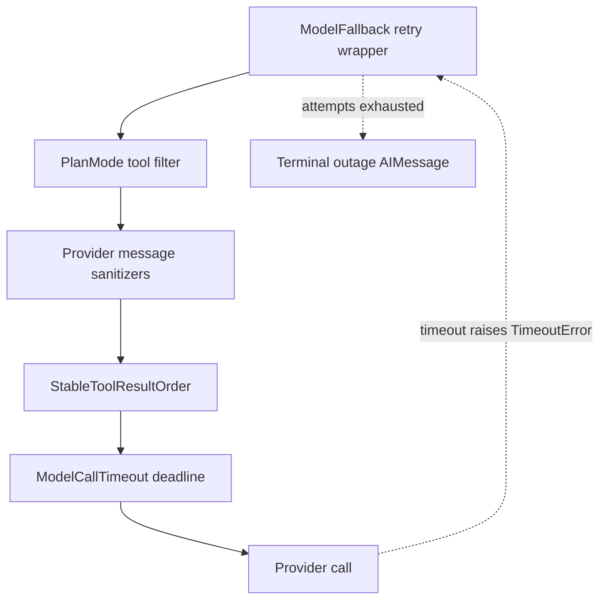

# Middleware Stack & Safety Layers

Every model call and tool call in the agent and reviewer runs through an ordered middleware chain. Deep Agents / LangChain compose wrappers as an *onion*: earlier list entries are outer layers, and the final entry is closest to the provider or tool executor. `get_agent` builds the agent graph and passes its explicit list to `create_deep_agent`; `get_reviewer_agent` builds the reviewer variant. See [Agent Graph](agent-graph.md), [Sandbox Lifecycle](sandbox-lifecycle.md), [Tools](../concepts/tools.md), and [Testing Overview](../testing/overview.md) for their surrounding concerns.

## Main Agent Middleware Order

The main agent's middleware list, outer to inner, is:

1. `PrepareAgentRunMiddleware` — initializes run state once per thread
2. `DynamicToolMiddleware` — adds integration tools when configured
3. `SanitizeToolInputsMiddleware` — coerces malformed integer tool arguments
4. `ModelCallLimitMiddleware` — caps total model calls at `MODEL_CALL_RECURSION_LIMIT`
5. `ToolErrorMiddleware` — catches tool exceptions and handles sandbox failures
6. `ExcludeToolsMiddleware` — filters tools from model requests
7. `SubdirAgentsReadMiddleware` — appends ancestor `AGENTS.md` instructions to read results
8. `ToolRetryMiddleware` — retries delegated `task` calls on transient failures
9. `PullRequestCreationGuardMiddleware` — blocks PR creation outside `open_pull_request` (non-local)
10. `WorkflowPushGuardMiddleware` — requires approval for `.github/workflows` changes
11. `refresh_github_proxy_before_model` — refreshes GitHub proxy token before each model call
12. `check_message_queue_before_model` — injects queued Linear/Slack messages (except in stop-summary mode)
13. `TimeoutWrapupMiddleware` — adds wrapup instruction after 45 minutes
14. `notify_step_limit_reached` — posts Slack notification when step limit is hit
15. `ModelFallbackMiddleware` — retries across primary and fallback models (when configured)
16. `PlanModeMiddleware` — strips external-mutation tools when plan mode is active
17. `SanitizeFireworksMessagesMiddleware` — sanitizes Fireworks provider responses
18. `SanitizeOpenAIResponsesMiddleware` — sanitizes OpenAI provider responses
19. `SanitizeThinkingBlocksMiddleware` — removes malformed empty thinking blocks
20. `StableToolResultOrderMiddleware` — ensures consistent tool result ordering
21. `ModelErrorMiddleware` — handles provider errors
22. `ModelCallTimeoutMiddleware` — innermost deadline protecting provider calls

The factory deliberately leaves `ModelCallTimeoutMiddleware` innermost: its wall-clock deadline covers the provider operation and its `TimeoutError` propagates outward into `ModelFallbackMiddleware`. The fallback wrapper retries that transient failure against the alternate provider. Message sanitizers are also at the inner end, where they see the final provider request. Tool input normalization and policy guards sit outside tool execution, so they may repair, block, or rewrite calls before a tool runs.

The relevant inner model-call layers show why a provider deadline reaches the fallback wrapper rather than silently parking the run.

## Model Timeout and Fallback

`ModelCallTimeoutMiddleware` reads `OPEN_SWE_MODEL_CALL_TIMEOUT_SECONDS` (default 900 seconds = 15 minutes) and turns a hung provider call into `ModelCallTimeoutError`, a `TimeoutError` subclass. This deadline complements the per-request `timeout` that `agent/utils/model.py` sets on every provider call: the middleware is the last resort, catching stalls in the OpenAI Responses websocket transport or network conditions that the SDK never notices.

`ModelFallbackMiddleware` is installed only when `LLM_FALLBACK_MODEL_ID` (or the primary model's default fallback) resolves to a different model. It alternates primary and fallback attempts with exponential backoff (default schedule: 0, 5, 15, 30, 45 seconds) plus ±25% jitter, for retryable HTTP status codes (408, 409, 425, 429, 5xx), connection and timeout errors, and the `TimeoutError` from `ModelCallTimeoutMiddleware`. An exhausted retry budget normally becomes a visible terminal `AIMessage` explaining the outage; a model-not-available access error is likewise surfaced directly without retry. Set `surface_outage_message=False` if platform-level alerting keys off failed runs instead.

## Tool Failures: Recoverable Result Versus Run-Ending Sandbox Failure

`ToolErrorMiddleware` surrounds tool calls. Ordinary unhandled exceptions are serialized as `ToolMessage(status="error")` payloads, retaining the error type and, when available, tool name, so the model can adjust its next action rather than the run crashing.

A `SandboxRetryableConnectionError` has a narrower meaning: the SDK guarantees the WebSocket upgrade was rejected before the execute frame was sent. Therefore nothing ran or changed. The middleware converts this *transient pre-start* failure into an error tool result with `recovery: "sandbox_transient"`, the prior error, and an optional parsed sandbox ID. The model can safely try again; it is not a declaration that the sandbox is dead. The shared `retry_transient_sandbox_errors` utility makes the same distinction for callers that perform an operation directly: it retries only this SDK type, at most four attempts (default), with bounded exponential backoff and jitter.

An unreachable sandbox is intentionally different and ends the run. A `SandboxConnectionError` is unreachable unless it is `SandboxServerReloadError` (which says the command is still running), and a `ResourceNotFoundError` qualifies only when its missing resource is the sandbox—not a tool-local missing file. For either unreachable case, `ToolErrorMiddleware` attempts a user-facing notification using the run configuration, then re-raises the original error. Continuing would make later sandbox calls fail and repeatedly notify the user. 

**Notification routing** chooses the triggering Slack thread first, then Linear issue, then a GitHub issue or PR when a token and target are available. The coding-agent message explicitly does not auto-provision a replacement: a new sandbox is empty and could hide loss of uncommitted work. Retrying the thread can try the same sandbox; a new thread can obtain a fresh one.

`sandbox_circuit_breaker` supplies notification and sandbox-ID helpers, not a registered middleware class. The reviewer has a separate lifecycle policy: its read-only checkout can be recreated, so reviewer sandbox setup opts into replacement; a failed replacement still raises a typed unreachable error.

## Reviewer Middleware Stack

The reviewer uses a leaner order: `PrepareReviewerRunMiddleware`, `SanitizeToolInputsMiddleware`, `ModelCallLimitMiddleware`, `ToolErrorMiddleware`, `refresh_github_proxy_before_model`, `check_message_queue_before_model`, `TimeoutWrapupMiddleware`, the three message sanitizers, `RepairOrphanedToolCallsMiddleware`, `StableToolResultOrderMiddleware`, `ModelErrorMiddleware`, `ModelCallTimeoutMiddleware`, and `settle_review_check_on_exit`.

It omits model fallback, plan mode, PR creation and workflow-push guards, and the `SubdirAgentsReadMiddleware`. Its repair hook scans messages before a model call and inserts a synthetic error `ToolMessage` after a tool call without a matching result. That keeps an interrupted run from leaving an unmatched tool ID that a provider rejects forever on a subsequent invocation.

## Run Preparation, Tool Availability, and User Follow-ups

`BasePrepareRunMiddleware` provides checkpointed, idempotent `before_agent` setup. Its checkpointed `run_prepared_for` latch lets a resumed attempt skip already completed setup, while a later invocation prepares new run state.

`DynamicToolMiddleware` adds integration tools only when configured; `ExcludeToolsMiddleware` is a local, public equivalent of Deep Agents' private tool-exclusion middleware and filters names from model requests.

`PlanModeMiddleware` is always present. It resets `plan_mode` to the current-run setting in `before_agent` and strips external-mutation tools from each request when enabled. Since it recomputes the tool list per call, an `enter_plan_mode` tool action affects the following turn.

`SanitizeToolInputsMiddleware` coerces malformed integer tool arguments such as `read_file` `offset` and `limit` by extracting the leading digit sequence, so the LLM-produced string like `'1, 80'` becomes the integer `1` and the call succeeds rather than burning an LLM turn on retry.

`SubdirAgentsReadMiddleware` appends applicable ancestor `AGENTS.md` content to `read_file` results only once per thread, as a `<system-reminder>` block. It walks from the read file's directory up to the root, collecting instructions from every `AGENTS.md` found, and injects them so scoped rules are visible before edits.

Before every model call, `refresh_github_proxy_before_model` refreshes a near-expiry installation token on the sandbox GitHub proxy. The subsequent queue hook (`check_message_queue_before_model`) consumes pending entries from the LangGraph `("queue", thread_id)` namespace in FIFO order, deletes an entry before constructing its human message to prevent duplicate processing, and also consumes the batched `("autofix", thread_id)` event. If the selected model lacks vision support, it drops queued images and adds a warning instead.

## Policy, Limits, and Delegated Tasks

`TimeoutWrapupMiddleware` adds a finish-and-end-turn instruction after `OPEN_SWE_WRAPUP_TIMEOUT_SECONDS` (default 45 minutes), signaling the model to wrap up gracefully rather than continue work. This is separate from the model call deadline and is purely advisory.

`notify_step_limit_reached` is an after-agent hook: when the last message bears the `ModelCallLimitMiddleware` limit marker, it posts a Slack explanation so the user gets a clear signal instead of silence.

The PR guard (`PullRequestCreationGuardMiddleware`) prevents `execute` and `background_execute` from bypassing `open_pull_request` with `gh`, GitHub API, or `curl` pull-request creation commands, including bounded nested `bash -c` forms. It returns an error tool message and is absent in local/desktop runs. The workflow guard (`WorkflowPushGuardMiddleware`) checks pushes that affect `.github/workflows`: a recorded human approval allows a rewritten safe command; otherwise it returns a blocked result with an approval URL.

`ToolRetryMiddleware` retries only delegated `task` calls using `task_retry_on` for retryable HTTP and transient transport failures, including a subagent `ModelCallTimeoutError`. Subagents have their own graphs and no fallback middleware, so that retry is their timeout escalation path. After retry exhaustion, `task_on_failure` returns structured `failed` data for prompt or context errors but re-raises other failures.

## Subagent Isolation

Subagents get their own middleware instances, not wrapped by parent middleware. A subagent's `ModelCallTimeoutMiddleware` is specific to its own model and configured through the `_subagent_model_timeout_middleware` spec. A wedged subagent call escalates via the parent's `ToolRetryMiddleware` on the `task` tool, not through the parent's fallback middleware.

## Focused Tests and Safe Changes

The middleware tests cover provider-timeout cancellation and fallback eligibility and alternation, as well as queue injection, run preparation, input and message sanitization, orphaned-call repair, stable result ordering, and subdirectory instructions. Sandbox retry tests specifically prove the safety boundary: pre-start gateway rejection retries, terminal `SandboxClientError` does not, and retries are bounded. Preserve the ordering when adding a wrapper—especially the innermost deadline/fallback relationship—and add a focused test when changing error classification or a tool short-circuit path.
