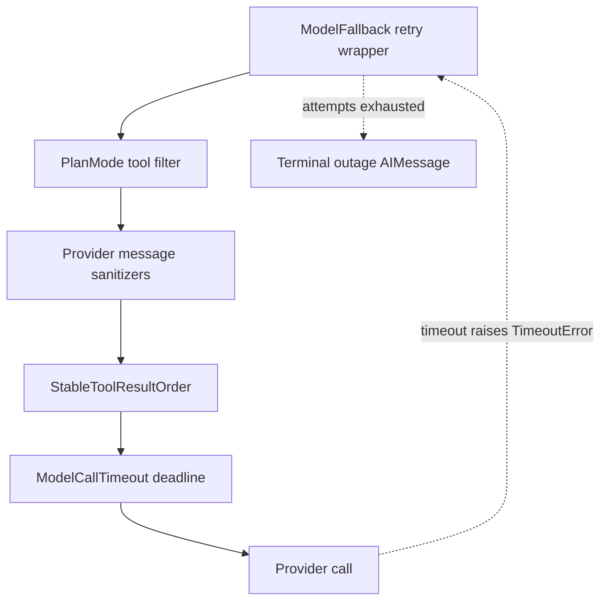

# Middleware Stack

Every model call and tool call runs through an ordered middleware chain. Deep
Agents / LangChain compose wrappers as an *onion*: earlier list entries are
outer layers, and the final entry is closest to the provider or tool executor.
`get_agent` builds the agent graph and passes its explicit list to
`create_deep_agent`; `get_reviewer_agent` builds the reviewer variant. See
[Agent Graph](agent-graph.md), [Sandbox Lifecycle](sandbox-lifecycle.md),
[Tools](../concepts/tools.md), and [Testing Overview](../testing/overview.md)
for their surrounding concerns.

## Agent order and ordering invariant

The main agent's middleware list, outer to inner, is:

1. `PrepareAgentRunMiddleware`
2. `DynamicToolMiddleware`, only when it has integration groups
3. `SanitizeToolInputsMiddleware`
4. `ModelCallLimitMiddleware`
5. `ToolErrorMiddleware`
6. `ExcludeToolsMiddleware`
7. `SubdirAgentsReadMiddleware`
8. `ToolRetryMiddleware`, scoped to `task`
9. `PullRequestCreationGuardMiddleware`, except on local/desktop runs
10. `WorkflowPushGuardMiddleware`
11. `refresh_github_proxy_before_model`
12. `check_message_queue_before_model`, except in stop-summary mode
13. `TimeoutWrapupMiddleware`
14. `notify_step_limit_reached`
15. `record_run_usage`
16. `ModelFallbackMiddleware`, only for a distinct configured fallback
17. `PlanModeMiddleware`
18. `SanitizeFireworksMessagesMiddleware`
19. `SanitizeOpenAIResponsesMiddleware`
20. `SanitizeThinkingBlocksMiddleware`
21. `StableToolResultOrderMiddleware`
22. `ModelErrorMiddleware`
23. `ModelCallTimeoutMiddleware`

The factory deliberately leaves `ModelCallTimeoutMiddleware` innermost: its
wall-clock deadline covers the provider operation and its `TimeoutError`
propagates outward into `ModelFallbackMiddleware`. The fallback wrapper retries
that transient failure against the alternate provider. Message sanitizers are
also at the inner end, where they see the final provider request. Tool input
normalization and policy guards sit outside tool execution, so they may repair,
block, or rewrite calls before a tool runs.

The relevant inner model-call layers show why a provider deadline reaches the
fallback wrapper rather than silently parking the run.

`ModelFallbackMiddleware` is installed only when `LLM_FALLBACK_MODEL_ID` (or
the primary model's default fallback) resolves to a different model. It
alternates primary and fallback attempts, with the default `0, 5, 15, 30, 45`
second schedule plus jitter, for retryable status, connection, and timeout
failures. An exhausted retry budget normally becomes a visible terminal
`AIMessage`; a model-not-available access error is likewise surfaced directly.
`ModelCallTimeoutMiddleware` reads `OPEN_SWE_MODEL_CALL_TIMEOUT_SECONDS`
(default 900 seconds) and turns a hung provider call into
`ModelCallTimeoutError`, a `TimeoutError` subclass.

## Tool failures: recoverable result versus run-ending sandbox failure

`ToolErrorMiddleware` surrounds tool calls. Ordinary unhandled exceptions are
serialized as `ToolMessage(status="error")` payloads, retaining the error type
and, when available, tool name, so the model can adjust its next action rather
than the run crashing.

A `SandboxRetryableConnectionError` has a narrower meaning: the SDK guarantees
the WebSocket upgrade was rejected before the execute frame was sent. Therefore
nothing ran or changed. The middleware converts this *transient pre-start*
failure into an error tool result with `recovery: "sandbox_transient"`, the
prior error, and an optional parsed sandbox ID. The model can safely try again;
it is not a declaration that the sandbox is dead. The shared
`retry_transient_sandbox_errors` utility makes the same distinction for callers
that perform an operation directly: it retries only this SDK type, at most four
attempts, with bounded exponential backoff and jitter.

An unreachable sandbox is intentionally different and ends the run. A
`SandboxConnectionError` is unreachable unless it is
`SandboxServerReloadError` (which says the command is still running), and a
`ResourceNotFoundError` qualifies only when its missing resource is the
sandbox—not a tool-local missing file. For either unreachable case,
`ToolErrorMiddleware` attempts a user-facing notification using the run
configuration, then re-raises the original error. Continuing would make later
sandbox calls fail and repeatedly notify the user. Notification chooses the
triggering Slack thread first, then Linear issue, then a GitHub issue or PR when
a token and target are available. The coding-agent message explicitly does not
auto-provision a replacement: a new sandbox is empty and could hide loss of
uncommitted work. Retrying the thread can try the same sandbox; a new thread can
obtain a fresh one.

`sandbox_circuit_breaker` supplies notification and sandbox-ID helpers, not a
registered middleware class. The reviewer has a separate lifecycle policy: its
read-only checkout can be recreated, so reviewer sandbox setup opts into
replacement; a failed replacement still raises a typed unreachable error.

## Reviewer stack

The reviewer uses this leaner order:
`PrepareReviewerRunMiddleware`, `SanitizeToolInputsMiddleware`,
`ModelCallLimitMiddleware`, `ToolErrorMiddleware`,
`refresh_github_proxy_before_model`, `check_message_queue_before_model`,
`TimeoutWrapupMiddleware`, the three message sanitizers,
`RepairOrphanedToolCallsMiddleware`, `StableToolResultOrderMiddleware`,
`ModelErrorMiddleware`, `ModelCallTimeoutMiddleware`, and `settle_review_check_on_exit`.

It omits model fallback, plan mode, PR creation and workflow-push guards,
`record_run_usage`, `DynamicToolMiddleware`, `ExcludeToolsMiddleware`,
`SubdirAgentsReadMiddleware`, `ToolRetryMiddleware`, `PullRequestCreationGuardMiddleware`,
and `notify_step_limit_reached`. Its repair hook scans messages before a model
call and inserts a synthetic error `ToolMessage` after a tool call without a
matching result. That keeps an interrupted run from leaving an unmatched tool
ID that a provider rejects forever on a subsequent invocation.

## Run preparation, tool availability, and user follow-ups

`BasePrepareRunMiddleware` provides checkpointed, idempotent `before_agent`
setup. Its checkpointed `run_prepared_for` latch lets a resumed attempt skip
already completed setup, while a later invocation prepares new run state.
`DynamicToolMiddleware` adds integration tools only when configured;
`ExcludeToolsMiddleware` is a local, public equivalent of Deep Agents' private
tool-exclusion middleware and filters names from model requests.

`PlanModeMiddleware` is always present. It resets `plan_mode` to the
current-run setting in `before_agent` and strips external-mutation tools from
each request when enabled. Since it recomputes the tool list per call, an
`enter_plan_mode` tool action affects the following turn. Separately,
`SanitizeToolInputsMiddleware` coerces malformed integer tool arguments such as
`read_file` `offset` and `limit`, and `SubdirAgentsReadMiddleware` appends
applicable ancestor `AGENTS.md` content only once per thread.

Before every model call, `refresh_github_proxy_before_model` refreshes a
near-expiry installation token on the sandbox GitHub proxy. The subsequent
queue hook consumes pending entries from the LangGraph `("queue", thread_id)`
namespace in FIFO order, deletes an entry before constructing its human message
to prevent duplicate processing, and also consumes the batched
`("autofix", thread_id)` event. If the selected model lacks vision support, it
drops queued images and adds a warning instead.

## Policy, limits, and delegated tasks

`TimeoutWrapupMiddleware` adds a finish-and-end-turn instruction after
`OPEN_SWE_WRAPUP_TIMEOUT_SECONDS` (45 minutes by default).
`notify_step_limit_reached` is an after-agent hook: when the last message bears
the `ModelCallLimitMiddleware` limit marker, it posts a Slack explanation.
`record_run_usage` captures LLM cost and execution time before the inner
middleware layers execute.

The PR guard prevents `execute` and `background_execute` from bypassing
`open_pull_request` with `gh`, GitHub API, or `curl` pull-request creation
commands, including bounded nested `bash -c` forms; it returns an error tool
result instead. It installs only on non-local runs.

`WorkflowPushGuardMiddleware` restricts the repository, branch, and workflow
name for `execute` runs that push commits. It allows only pushes to the
configured work branch and only for approved automation workflows; an attempted
bypass is detected and turned into an error tool result without running.

The `task` tool wraps delegated-subagent invocations. `ToolRetryMiddleware`
scoped to `task` with `task_retry_on` retries on HTTP 5xx/429 statuses and
transient exception names (including a subagent's `ModelCallTimeoutError` since
subagents lack fallback middleware), while `task_on_failure` returns a
structured failed payload for prompt/context errors and re-raises otherwise.

## Message and tool sanitization

The three message sanitizers (`SanitizeFireworksMessagesMiddleware`,
`SanitizeOpenAIResponsesMiddleware`, `SanitizeThinkingBlocksMiddleware`) filter
the provider request to remove:
- Fireworks vendor artifacts and deprecated tool-use schemas
- OpenAI API response format overrides and incompatible tool definitions
- Thinking blocks and reasoning tokens when not supported by the model

They install unconditionally but are no-ops unless the model needs their
transformation. They run near the innermost layer so they see and transform
the final request before the provider call.

`StableToolResultOrderMiddleware` normalizes the tool result message order
in the state before each model call, ensuring tools return in definition order
regardless of execution or return order. This improves consistency and prompt
determinism.

`RepairOrphanedToolCallsMiddleware` (reviewer only) scans the outgoing message
list before a model call and inserts a synthetic error `ToolMessage` immediately
after any `tool_call` whose ID has no corresponding `ToolMessage`. This keeps an
interrupted run from leaving an unmatched tool ID that a provider rejects
forever on subsequent invocation.

`ModelErrorMiddleware` wraps the model call to log a full exception traceback
and classify the failure (e.g., overloaded, access error, connection failure)
on the thread metadata for observability, then re-raises unchanged.

## Subagent isolation

Subagents compile into their own graphs and receive a much leaner middleware
stack: only message sanitizers, `ModelErrorMiddleware`, and
`ModelCallTimeoutMiddleware`. They do not inherit the parent's fallback,
plan mode, policy guards, or other run-preparation infrastructure. The task
tool that invokes them uses its own `ToolRetryMiddleware` to ride out transient
subagent timeouts.
