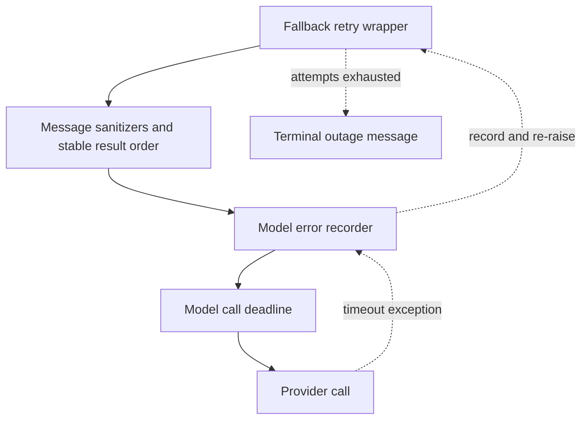

# Middleware Stack and Request Processing

`get_agent` and `get_reviewer_agent` pass ordered middleware lists to `create_deep_agent`. The list is an onion: earlier entries wrap later entries, so an outer layer can alter a request or handle an exception from every inner layer. This makes order part of the runtime contract, rather than an implementation detail.

## Coding-agent middleware stack

The coding-agent chain (outer to inner):

1. **ConversationOffloadingMiddleware** — Defers conversation context when configured by the user, permitting long runs without hitting provider context limits.

2. **PrepareAgentRunMiddleware** — Checkpointed per-run setup. Fingerprints the latest message, middleware class, and preparation configuration. A matching `run_prepared_for` latch skips already-checkpointed setup on a resumed invocation; a later invocation on the same thread gets fresh tokens, prompt material, and review/diff context. Preparation must remain idempotent because a failure before the checkpoint can run it again. Its model wrapper installs the rendered system prompt.

3. **TranscriptMiddleware** — Records run activity for session playback.

4. **IncidentMiddleware** — Only if an incident session is present; contributes incident-specific tools and context.

5. **WorkspaceSkillsMiddleware** — Only if configured (non-local, org admins); exposes organization and user custom skills.

6. **DynamicToolMiddleware** — Only if it has integration groups; exposes configured integration groups lazily (e.g., MCPs, Notion).

7. **SanitizeToolInputsMiddleware** — Repairs known malformed integer arguments such as `read_file` `offset` and `limit`.

8. **ValidateImageReadsMiddleware** — Validates image-read tool calls, positioned after sanitization to allow basic repair before deeper validation.

9. **ModelCallLimitMiddleware** — Tracks model calls and ends the run when the recursion limit is reached.

10. **ToolErrorMiddleware** — Converts ordinary unhandled tool exceptions into `ToolMessage(status="error")` JSON carrying error type, error text, and tool name. `SandboxRetryableConnectionError` (WebSocket upgrade rejected before execute frame) is converted to a `sandbox_transient` error, explicitly stating nothing ran or changed. A `SandboxConnectionError` (except `SandboxServerReloadError`), or `ResourceNotFoundError` only for the sandbox resource, means the sandbox is unreachable—these are notified and re-raised to end the run.

11. **ExcludeToolsMiddleware** — Filters disallowed tool names from model requests (e.g., stop-summary, incident-automatic exclusions).

12. **SubdirAgentsReadMiddleware** — Contributes applicable ancestor `AGENTS.md` instructions once per thread.

13. **ToolRetryMiddleware** — Scoped to the `task` tool with two retries, one-second initial delay, and ten-second maximum delay. `task_retry_on` accepts 5xx/429-class statuses and transient exception names (including a subagent's `ModelCallTimeoutError` since subagents have no fallback middleware). On exhaustion, `task_on_failure` returns structured `failed` data only for invalid-prompt/context-length failures and re-raises other errors.

14. **PullRequestCreationGuardMiddleware** — Except for local/desktop runs; blocks `execute` and `background_execute` command forms that create a pull request outside `open_pull_request`, including GitHub CLI, API, curl, and nested bash forms. Returns a tool error instead of executing.

15. **WorkflowPushGuardMiddleware** — Blocks push changes to `.github/workflows` files without recorded human approval, returning a blocked result with an approval URL.

16. **refresh_github_proxy_before_model** — Before-model hook that refreshes a near-expiry sandbox GitHub-proxy installation token (expires after one hour, would otherwise cause 401s on git/gh commands in long-running agents).

17. **check_message_queue_before_model** — Except in stop-summary mode; before-model hook that reads `("queue", thread_id)` from the LangGraph store, deletes `pending_messages` before constructing messages to avoid duplicate delivery, and injects queued human input in FIFO order to handle follow-up messages that arrive while the agent is busy.

18. **TimeoutWrapupMiddleware** — Starts its clock lazily per middleware instance and, after `OPEN_SWE_WRAPUP_TIMEOUT_SECONDS` (45 minutes by default), appends an instruction to finish the current step, preserve/report useful state, and avoid new investigation.

19. **RequireUserReplyMiddleware** — Re-invokes the model when a turn that owes the user an answer ends without calling the reply tool. Tracks reply surface (Slack vs. web), issues nudges up to a small budget, then gives up to avoid infinite loops.

20. **notify_step_limit_reached** — After-agent hook that recognizes the model-call-limit marker and posts an explanatory Slack message.

21. **record_run_usage** — After-agent hook. When the run has a preparation-run ID, persists summarized token usage and schedules deferred cost enrichment. Its own persistence failures are logged at debug level and do not change the agent result.

22. **ModelSelectionMiddleware** — Only when adaptive model routing is enabled; allows the agent to route requests between a primary and alternate model based on configured routing rules.

23. **ModelFallbackMiddleware** — Only when a different fallback model resolves; wraps the model call in a retry loop that alternates between the primary and cross-provider fallback model on transient errors. Uses an exponential backoff schedule with jitter (by default: delays `0, 5, 15, 30, 45` seconds, making six attempts total). Retries on 5xx/429-class statuses, connection/timeout errors, and `TimeoutError` from `ModelCallTimeoutMiddleware`. An Anthropic/OpenAI model-not-available access error is immediately converted to a user-facing `AIMessage`; exhausted attempts normally return a terminal outage `AIMessage`.

24. **SanitizeFireworksMessagesMiddleware** — Cleans Fireworks-specific message artifacts for cross-provider compatibility.

25. **SanitizeOpenAIResponsesMiddleware** — Cleans OpenAI-specific message artifacts for cross-provider compatibility.

26. **SanitizeThinkingBlocksMiddleware** — Removes extended thinking blocks from messages for providers that do not support them.

27. **StableToolResultOrderMiddleware** — Orders tool results consistently to avoid spurious provider request differences.

28. **ModelErrorMiddleware** — Logs and classifies model-call exceptions. Records the error type and classification code in thread metadata when context is available, and re-raises the original exception unchanged. Positioned inside fallback so it records every attempt's failure and its classification.

29. **ModelCallTimeoutMiddleware** — Innermost. Converts stalled provider calls (wall-clock deadline, not HTTP timeout) to `ModelCallTimeoutError`, which is a `TimeoutError`. Positioned innermost so its deadline covers the provider call itself, and a resulting timeout passes through `ModelErrorMiddleware` for classification before reaching the optional fallback wrapper. Reads `OPEN_SWE_MODEL_CALL_TIMEOUT_SECONDS`, validates that it is positive, and otherwise uses 900 seconds.

### Model-call boundary and error flow

The inner model-call path: timeout errors are recorded before the outer fallback decides whether to retry them. A timeout becomes either a retried request (with the fallback model) or a controlled, visible end to the run rather than a silent parked invocation.

## Retry and failure boundaries

### Sandbox errors

`retry_transient_sandbox_errors` retries only the SDK-marked pre-start error (`SandboxRetryableConnectionError`), at most four times, with bounded exponential backoff and jitter. Terminal sandbox errors (after command starts or sandbox unreachable) are never retried. Unreachable notification prefers the active Slack thread, then Linear, then a configured GitHub issue or PR if a token is available. Coding-agent recovery deliberately does not auto-replace a sandbox because a fresh sandbox could conceal loss of uncommitted work; users can retrigger the thread or start a new one.

### Model call timeouts and fallback

`ModelCallTimeoutMiddleware` reads `OPEN_SWE_MODEL_CALL_TIMEOUT_SECONDS`, validates that it is positive, and otherwise uses 900 seconds. `asyncio.wait_for` makes a websocket or other provider stall observable; it deliberately sits above provider-level request timeouts, which get a chance to retry inside the provider client first.

## Reviewer stack and completion guarantee

The reviewer uses a deliberately smaller chain:

1. **PrepareReviewerRunMiddleware** — Checkpointed per-run setup for reviewer specialization.

2. **SanitizeToolInputsMiddleware** — Same as main agent.

3. **ModelCallLimitMiddleware** — Tracks calls; ends the run when the limit is reached.

4. **ToolErrorMiddleware** — Same as main agent.

5. **refresh_github_proxy_before_model** — Same as main agent.

6. **check_message_queue_before_model** — Same as main agent; handles follow-up messages.

7. **TimeoutWrapupMiddleware** — Same as main agent.

8. **SanitizeFireworksMessagesMiddleware** — Same as main agent.

9. **SanitizeOpenAIResponsesMiddleware** — Same as main agent.

10. **SanitizeThinkingBlocksMiddleware** — Same as main agent.

11. **RepairOrphanedToolCallsMiddleware** — Prevents an interrupted review from being permanently rejected by a provider. Before a later model call, inserts synthetic error `ToolMessage` results for tool-call IDs that have no result. When a run is cancelled or the sandbox dies mid-tool-call, LangGraph persists the `AIMessage` with the `tool_call` but never the matching `ToolMessage`. On the next run a fresh human message lands where the tool result should be, so the provider rejects the request (e.g., Anthropic: `` `tool_use` ids were found without `tool_result` blocks``). This middleware repairs the wedged state.

12. **StableToolResultOrderMiddleware** — Same as main agent.

13. **ModelErrorMiddleware** — Same as main agent.

14. **ModelCallTimeoutMiddleware** — Same as main agent.

15. **settle_review_check_on_exit** — After-agent hook. Closes a tracked but unpublished GitHub review check as **neutral** rather than falsely marking the PR's code as failed. If `publish_review` recorded a pending completion result whose PATCH failed transiently, the hook retries that real conclusion instead. This ensures an incomplete review infrastructure failure is not misreported as a PR code failure.

The reviewer omits conversation offloading, incident, workspace skills, dynamic tools, tool exclusion, subdirectory instructions, task retry, PR/workflow guards, run-usage recording, model selection, and model fallback. Reviewer sandbox setup opts into replacement because its checkout is re-derived for each run and a persistent PR thread should not be bricked by a dead sandbox. A failed replacement remains `SandboxUnreachableError` and is notified safely.

## Follow-up message handling

`check_message_queue_before_model` is a before-model hook that reads the LangGraph store namespace `("queue", thread_id)`, deletes the `pending_messages` key **before** building messages to avoid duplicate delivery, and injects queued human input in FIFO order. This enables handling of follow-up comments (e.g., Linear comments, Slack replies) that arrive while the agent is busy. The agent sees the new messages and can incorporate them into its response.

## Safe changes and focused tests

Preserve the outer-to-inner arrangement when adding middleware. In particular:
- Moving the deadline outside fallback would prevent timeout recovery.
- Moving error recording outside fallback would miss failures the fallback consumes.
- Keep preparation idempotent.
- Retain delete-before-inject queue semantics.
- Treat a sandbox error as retryable only when the SDK guarantees the command never started.

Focused middleware tests cover queue injection, dynamic tool behavior, preparation latching, sanitizers, orphaned-call repair, stable result ordering, timeout cancellation, fallback alternation/eligibility, step-limit notification, subdirectory instructions, and usage recording. Sandbox recovery tests verify that reviewer replacement is permitted, default coding-agent replacement is not, and a failed replacement remains typed. These are the tests to extend when changing an ordering edge, error classification, or a completion short-circuit.
