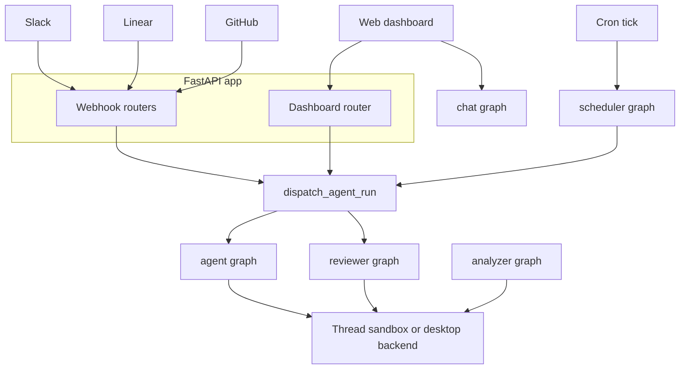

# System Architecture Overview

Open SWE is deployed as a LangGraph server with five registered graphs and a custom FastAPI application. The HTTP application accepts dashboard and integration traffic; durable run creation then invokes the coding or reviewer graph against thread-scoped state and, where applicable, a sandbox. The specialized analyzer, chat, and scheduler graphs are invoked through their own graph entrypoints.

## Deployment structure

`langgraph.json` is the cloud deployment manifest. It registers thin `agent/graphs/` re-export modules as stable dotted entrypoints, mounts `agent.webapp:app`, and supplies the checkpointer and environment configuration. The cloud manifest pins **Python 3.12** and **LangGraph API version 0.12.7**. Its checkpointer uses a `delete` strategy, sweeps every 60 minutes, and defaults to a TTL of 43,200 minutes (30 days). Environment variables are loaded from `.env`.

| Graph | Registered entrypoint | Implemented in | Runtime responsibility |
|---|---|---|---|
| `agent` | `agent.graphs.agent:traced_agent` | `agent/server.py` | Per-run coding agent factory; assembles tools, middleware, models, and a thread backend. |
| `reviewer` | `agent.graphs.reviewer:traced_reviewer_agent` | `agent/reviewer.py` | PR reviewer with a findings-and-publication workflow and read-only tools. |
| `analyzer` | `agent.graphs.analyzer:traced_analyzer` | `agent/analyzer.py` | Learns repository-specific guidance for the reviewer from historical PRs and outcomes. |
| `chat` | `agent.graphs.chat:traced_chat_agent` | `agent/chat.py` | Sandbox-less, read-only PR discussion agent for the review UI. |
| `scheduler` | `agent.graphs.scheduler:get_scheduler` | `agent/scheduler.py` | Receives scheduled ticks and fans them into maintenance work or scheduled runs. |

This diagram shows the principal invocation paths. `dispatch_agent_run` is the shared contract for `agent` and `reviewer` runs triggered from Slack, Linear, GitHub, the dashboard, and the scheduler; the analyzer, chat, and scheduler graphs have their own entrypoints.

## Entrypoints and graph factories

### Main agent and get_agent factory

`agent/server.py:get_agent` is the main graph factory. Called per-thread, it:

1. Resolves the GitHub token (via OAuth session or team default)
2. Gets-or-creates the thread's sandbox backend (or uses a local shell for desktop runs)
3. Resolves the team/profile/per-thread model choice and effort level
4. Constructs a fresh `create_deep_agent(...)` with a curated tool list and middleware stack

All per-thread state lives in the sandbox and thread metadata; the agent itself is stateless. A missing `thread_id` or a graph load that is not marked for execution returns a trivial no-sandbox deep agent instead of provisioning resources.

### Reviewer graph

`agent/reviewer.py:get_reviewer_agent` mirrors the main agent's sandbox lifecycle but wires a review-only toolset: `add_finding`, `update_finding`, `list_findings`, `publish_review`, `web_search`, `fetch_url`, and `http_request`. It has no commit, push, or PR-opening tools. The reviewer's findings model and diff-anchored filing bar are pinned in its system prompt.

The reviewer permits sandbox replacement (`allow_replacement=True`), because its sandbox holds only a checkout that `prepare_review_repo` re-derives every run. Reviewer threads are one-per-PR and outlive their sandbox; without this override a deleted sandbox would brick all reviews on that PR permanently.

### Analyzer graph

`agent/analyzer.py:get_analyzer` mines historical human PR reviews and this reviewer's own past finding outcomes to teach the reviewer what this team flags and skips. It emits a per-repository review-style prompt via the `save_review_style_prompt` tool, consumed by the reviewer as a "repository-specific review style" appendix.

The analyzer runs in one of two modes (via `analyzer_mode` in `configurable`):

- **bootstrap**: cold-start crawl of historical PR reviews
- **continual**: nightly refinement using this reviewer's own finding outcomes

Each mode's procedure lives in a deepagents skill served as virtual files. The analyzer uses the same sandbox and `gh` pattern as the reviewer. GitHub App installation tokens are injected into the LangSmith GitHub proxy so `gh` works on public repos even when the App is not installed.

### Chat graph

`agent/chat.py:get_chat_agent` is a read-only "chat with this PR" agent for the review UI. Unlike the main agent and reviewer, it has **no sandbox**: it answers questions about a single pull request using the diff, published review findings, and read-only access to the repository over the GitHub API.

PR context (diff, findings, overview) is seeded as virtual files under `/pr/` into the `files` state channel by the dashboard chat proxy; the built-in `read_file` and `grep` tools operate over those. Repo coordinates and the reviewer thread id arrive in `configurable`; a repo-scoped GitHub App token is resolved here so the GitHub-backed tools never receive a user credential.

### Scheduler graph

`agent/scheduler.py:get_scheduler` is a compiled, single-node `StateGraph`. Its `_launch` node dispatches a cron tick to the right background task by `task` name:

- `"reconcile"`: reconciliation of stale runs
- `"baby_sit"`: watch evaluation for CI monitoring
- `"background-task"`: background-task monitoring
- `"session_cost"`: session-cost refresh
- (default): `launch_scheduled_agent_run` for a scheduled agent run

Missing required identifiers (`watch_key`, `thread_id`, `schedule_id`) return a structured status rather than launching an ambiguous job. Scheduled agent runs ultimately use the same durable dispatch mechanism as interactive agent runs, fanning time-based ticks into fresh agent threads.

## HTTP composition and ingress

`agent/webapp.py` is only a compatibility re-export of the application assembled by `agent/api/app.py:create_app`. That factory:

1. Pins a single event loop before queue workers are built (Open SWE cannot survive them landing on different loops)
2. Configures credentialed CORS from `DASHBOARD_ALLOWED_ORIGINS`, refusing a wildcard origin in that mode
3. Mounts dashboard, plan, workflow-approval, Linear, Slack, GitHub, and health routers
4. Uses a lifespan hook to validate sandbox and local-development LLM configuration at startup, and closes cached models at shutdown

### Webhook routing

Slack, Linear, and GitHub webhook routers (`agent/slack/routes.py`, `agent/linear/routes.py`, `agent/github/routes.py`) normalize their external events into deterministic thread identities. Follow-up activity for the same external conversation, issue, or PR can therefore return to the same LangGraph thread and its durable context instead of creating an unrelated agent session.

Each webhook handler:

1. Validates the signature (HMAC-SHA256 for GitHub, HMAC-SHA1 for Linear, Slack signing secret)
2. Extracts the deterministic `thread_id` from event identifiers (Slack channel + thread ts, Linear issue id, GitHub repo + PR/issue number)
3. Calls `dispatch_agent_run` via the durable contract

### Dashboard router

The dashboard router is rooted at `/dashboard/api` and applies a same-origin mutation guard for browser-originating changes. It owns:

- GitHub OAuth login/callback and user sessions
- User profiles, team settings, and administration
- Enabled-repository lists and review-style management
- Thread APIs for the web UI (thread creation, message history, run streaming)

Importing `agent.dashboard` does not eagerly load the full route surface: its lazy `router` attribute (PEP 562 `__getattr__`) imports `routes.py` only when the webapp mounts it. This avoids dragging in FastAPI, the job API surface, and other heavy dependencies into middleware and graphs that merely need dashboard settings.

## Durable dispatch and state ownership

`dispatch_agent_run` is the shared run-creation boundary for Slack, Linear, GitHub, dashboard, and scheduled **agent/reviewer** triggers. It:

1. Selects the graph via `assistant_id` (`"agent"` or `"reviewer"`)
2. Treats `source` as metadata/logging only (it does not select behavior)
3. Creates runs with:
   - `multitask_strategy="interrupt"` by default — a follow-up halts the active run (progress preserved by the sync checkpoint) and resumes with full history + the new message
   - `durability="sync"` — checkpoint before each step so a crash/recycle resumes from the last checkpoint
   - `stream_resumable=True` — the run's event stream is retained so a client that attaches later can replay it (critical for dashboard observability)
   - the Protocol v2 run shape (`stream_mode` set, `stream_subgraphs`, and `EVENT_STREAMING_V2_CONFIG_KEY` marker) so the server emits every protocol channel (tools, lifecycle, namespaced subagent events) regardless of stream_mode

Completion delivery is conditional: the dispatch layer attaches a completion webhook only when `RUN_COMPLETE_WEBHOOK_SECRET` is set and `COMPLETION_WEBHOOK_URL` is an absolute non-loopback URL. Invalid relative or loopback configuration disables the webhook with a warning rather than making every run creation fail.

### State and lifecycle

The factory object is ephemeral, but the system is not stateless:

- **LangGraph checkpoints** preserve graph state, including chat history, tool results, and reasoning steps
- **Thread metadata** persists sandbox identity, GitHub token, model choices, and per-thread settings across processes
- **In-process sandbox backend cache** (keyed by `thread_id`) holds live backend connections; persisted sandbox metadata lets a new worker reconnect to the same sandbox

The per-thread sandbox lifecycle is:

1. **Sandbox cached in memory** → ping it (`echo ok`), then refresh the GitHub proxy with a fresh token
2. **Metadata has an id but no cache** → reconnect, then refresh the GitHub proxy
3. **No sandbox at all** → create one and persist the id

An existing sandbox that cannot be reached raises `SandboxUnreachableError` rather than being replaced: a replacement is empty, so swapping one in would destroy uncommitted work while the agent carried on believing it was still there. The main agent catches that in `PrepareAgentRunMiddleware` and notifies the user via `post_sandbox_unreachable_notification`. The reviewer can opt into replacement because its checkout is re-derived for each run.

Every sandbox creation or refresh calls `_configure_github_proxy` with a fresh GitHub App installation token, injecting Basic auth for `github.com` git traffic and Bearer auth for `api.github.com`, so sandbox commands run plain `gh ...` with no real token in the sandbox. Every run re-applies `git config --global user.name/email` for the bot identity, because reused sandboxes can lose `--global` config.

## Desktop and local development

`langgraph.desktop.json` is narrower than the cloud manifest: it registers only the main agent graph, uses `agent.local_auth:auth` with Studio auth disabled, and disables the bundled UI.

A desktop run is recognized from `configurable.source == "desktop"` and uses `LocalShellBackend` rooted in a requested project only after that path passes the `OPEN_SWE_LOCAL_PROJECTS_FILE` allowlist. Desktop artifacts are routed outside the project directory (to a temporary artifacts directory or `OPEN_SWE_LOCAL_ARTIFACTS_DIR`) so tool-result and history files are not accidentally included in a later `git add -A`. Worktrees created by the desktop app are also trusted as valid project paths when they reside under `OPEN_SWE_LOCAL_WORKTREES_DIR`.

## Dashboard UI

The `ui/` application is a TanStack Router React client. Its route tree includes:

- **Agent sessions**: cloud and local agent sessions, threads, plans, skills, and automations/schedules
- **Reviews**: review management, review styles, and PR-scoped review chat
- **Administration**: settings, environments, instructions, integrations, usage, sandbox views
- **Authentication**: login and OAuth flow

The `/agents` layout requires a session except for enabled desktop-local routes, and creates the stream provider with `cloud` or `local` transport accordingly. Browser calls use the dashboard API prefix (`/dashboard/api/...`); the review chat client targets the PR-scoped `/dashboard/api/reviews/{owner}/{repo}/{number}/chat` proxy.

## Operations and change guide

- **Add a deployable graph**: Export a stable factory through `agent/graphs/` and register it in the appropriate manifest. Do not assume it will be eligible for `dispatch_agent_run`: that contract currently documents `agent` and `reviewer` selection.
- **Add browser APIs**: Mount an `APIRouter` from `create_app`; preserve the dashboard router's mutation-origin and session protections rather than bypassing its proxy layer.
- **Sandbox reconnection**: Treat an unreachable coding sandbox as a recovery decision, not a normal cache miss. Replacing it changes the thread's working tree and can discard uncommitted work.
- **Dispatch and streaming**: When changing dispatch defaults or stream protocol fields, exercise the dispatch tests and the cross-surface run-event test. Dashboard observability depends on runs created outside the browser retaining resumable Protocol v2-compatible events.

## Related pages

[Agent Graph & get_agent Factory](./agent-graph.md) · [Middleware Stack](./middleware-stack.md) · [Sandbox Lifecycle](./sandbox-lifecycle.md) · [Reviewer & Review-Style Analyzer Graphs](./reviewer-and-analyzer.md) · [Invocation](../workflows/invocation.md)
