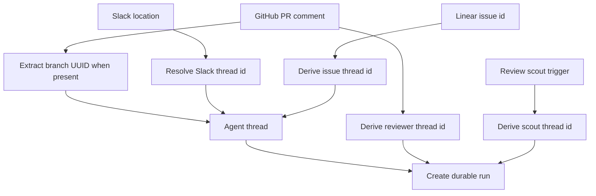
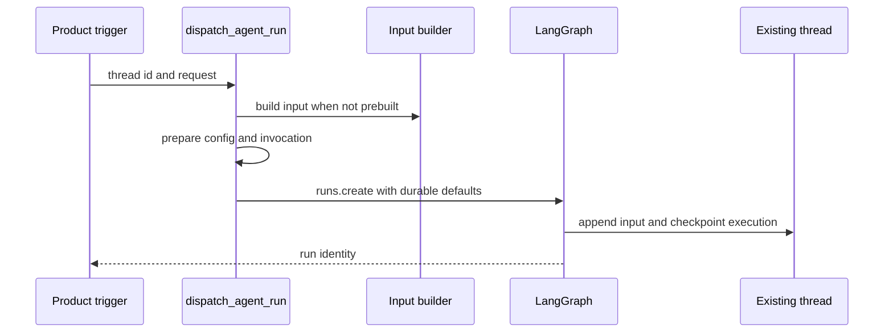

# Threads, Invocations, and Persistent State

A LangGraph thread is Open SWE's unit of continuity. A stable `thread_id` selects a conversation's checkpointed graph state and message history; thread metadata holds durable, queryable facts about that conversation; and the LangGraph Store holds separately namespaced application records. A run is an execution on that thread, not a replacement for it.

Every run belongs to exactly one **invocation** — a unit of work triggered by one webhook, dashboard action, or background task. An invocation owns its run ID, configurable state, and logging context; when a follow-up message arrives on the same thread, a new run begins with a different invocation ID. The dispatch contract ensures one creation per invocation, which prevents duplicate work and lets the dashboard and completion webhooks track a single async operation from start to finish.

The boundary matters when changing an integration: a webhook, dashboard action, reviewer, or background task must route a follow-up to the right existing thread, supply a new input with a fresh invocation, and respect sandbox continuity. It must not manufacture a random identity, overwrite another surface's source context, or replace a sandbox merely because a reconnect failed.

## Identity is a persistence contract

`agent/thread_ids.py` is the single home for deterministic thread-id derivation. Its exact keys and namespaces are persisted routing contracts: separate processes re-derive IDs from external identifiers, so changing a formula makes existing threads unreachable through their normal entrypoints.

| Conversation or purpose | Derivation | Stable key |
| --- | --- | --- |
| Slack location | `slack_thread_id` | `slack:{channel}:{timestamp}:{nonce}` |
| PR comment on a non-Open-SWE branch | `pr_comment_thread_id` | `{owner}/{repo}/pr/{pr_number}` |
| Reviewer for a PR | `reviewer_thread_id` | `{owner}/{repo}/pr/{pr_number}/reviewer` |
| Review scout for a PR | `review_scout_thread_id` | `{owner}/{repo}/pr/{pr_number}/review-scout` |
| Review chat for a PR | `review_chat_thread_id` | `{owner}/{repo}/pr/{pr_number}/chat/{login.lower()}` |
| Repository review style | `review_style_thread_id` | `{owner}/{repo}/review-style` |
| Linear issue | `linear_issue_thread_id` | `linear-issue:{issue_id}` |
| GitHub issue | `github_issue_thread_id` | `github-issue:{issue_id}` |
| Baby-sit lock | `baby_sit_lock_thread_id` | `open-swe:baby-sit-lock:{key}` |

Slack, PR-comment, reviewer, review-scout, review-chat, review-style, and baby-sit lock IDs are URL-namespace UUIDv5 values derived via `uuid.uuid5(uuid.NAMESPACE_URL, stable_key)`. Linear and GitHub issue IDs use `_sha256_uuid`, which constructs a UUID-shaped string from the SHA-256 hash of the key. The reviewer and scout keys deliberately differ from the agent PR-comment key, so a PR's autonomous reviewer, scout, and agent conversations cannot collide.

For a PR that Open SWE created, the GitHub PR-comment handler first extracts a UUID embedded in the branch with `thread_id_from_branch`; only a branch without one uses `pr_comment_thread_id`. Linear delivery uses `linear_issue_thread_id(issue_id)`, so redelivery stays on the issue's thread.

Thread identity lets independently triggered work converge on the correct durable conversation.

### Slack mappings support moves and retirement

Slack has a Store-backed mapping in a per-channel namespace, keyed by the Slack thread timestamp. `resolve_slack_thread_id` checks that explicit mapping first. If absent, it searches thread metadata for matching `source_context`; it rejects multiple matches, otherwise binds the matching ID or the deterministic Slack fallback. Binding validates the Slack location, refuses a conflicting existing mapping, then reads back the write. Thus one Slack location cannot silently be assigned to two Open SWE threads.

Deleting associations does not simply erase the map: it writes a fresh nonce at that location. With no mapped ID, a future resolution derives a different fallback ID, avoiding collision with the retired conversation. This is used by moves such as creating a code channel.

A code channel is one session for the whole channel, keyed by `CODE_CHANNEL_SESSION_TS = "0"`, not a Slack reply thread. `manage_code_channel` binds the existing agent thread to `(channel_id, "0")` and changes its `source_context`. The sentinel selects `conversations.history` without `ts`; ordinary Slack conversations use `conversations.replies` with the thread timestamp. Slack's `processing`, `active`, `suspended`, and `closed` session statuses are Slack UI lifecycle state, distinct from LangGraph thread status.

## State ownership and metadata

Thread metadata is the durable cross-surface index and small per-thread state. `source_context` identifies the originating Slack location, Linear issue, GitHub issue, or PR; its Pydantic model permits unknown fields and preserves only supplied fields on output. It parses malformed historical metadata as an empty context rather than breaking a run. Upsert logic keeps the opening context rather than letting later activity repoint a thread, preserves the first title, and stores participant identities as metadata.

Participant logins and emails use key-per-person maps such as `{"octocat": true}`, rather than lists. That shape permits a JSONB containment query for one participant. Reviewer threads additionally carry `kind = "reviewer"`, plus reviewer-specific metadata such as PR state, head SHA, watch flag, and findings. The kind is both a UI/query discriminator and a completion-handling boundary: normal agent Slack completion work is skipped for reviewer threads.

Thread-level settings are a separate metadata snapshot under `agent_settings`. On the first run, model, effort, subagent model/effort, and repository instructions are chosen for the thread; sender identity, personal instructions, and PR preferences remain per-message context. Later profile edits do not change the snapshot unless a caller explicitly stores a replacement, such as a model override. Reads cache for five minutes and reads/writes fail soft, so settings storage cannot prevent a run. Strict normalization drops invalid or obsolete settings rather than retaining arbitrary profile data.

The LangGraph Store is not thread metadata. `agent/store.py` is the sanctioned wrapper for namespaced key/value access: a missing item returns `None`, whereas other HTTP failures propagate. This makes an outage observably different from an empty record. `TypedStore` validates records through a Pydantic model; `get` fails for an unreadable requested record, while listings log and skip malformed records so one old record does not take down a listing.

## Follow-up input and run configuration

Each run supplies new messages; the graph retains its thread state. `build_run_input` serializes the authored request into a `<input-message>` envelope with a namespaced sender, surface, kind, optional channel, and structured data. It may precede that request with channel and system `<dynamic-context>` introductions. Entity IDs are validated and text is escaped; Slack channel topic and purpose are marked untrusted.

Dynamic context blocks are content-hashed. `build_input_messages` excludes introductions already recorded in the injected-hash set. When summarization has moved early messages behind its cutoff, `visible_dynamic_context_hashes` treats those hidden blocks as no longer visible, allowing necessary identity context to be introduced again. This prevents deduplication state from making a summarized conversation lose information the model can no longer see.

`configurable` is the per-run transport contract, not durable thread state. `RunConfig` accepts unknown keys and dumps only fields that were supplied, so independent writers can enrich it without erasing one another's keys. Parsing is deliberately tolerant: invalid fields are dropped iteratively while valid fields, including a thread ID, survive. Its values are optional because each graph and trigger needs a different subset.

## Invocation ownership and dispatch

Every run belongs to exactly one **invocation**, represented by an `invocation_id` (with legacy alias `prepare_run_id`) that flows through both `configurable` and run metadata. `resolve_invocation_id` recovers an existing invocation from either location and rejects conflicting IDs; `new_invocation_id` generates a fresh UUID4 when none is present. The invocation is the unit of work ownership: it starts when dispatch creates a run and ends when the run completes or fails. Follow-up messages on the same thread use a different invocation.

The dispatch contract is enforced through `prepare_run_config`: it resolves or generates an invocation ID, enriches the run with that ID in both names (canonical `invocation_id` and legacy `prepare_run_id`), adds the Protocol v3 streaming marker, and merges supplied metadata. This ensures every run in the deployment carries a canonical invocation identity.

## Durable dispatch and checkpoints

All product triggers use `dispatch_agent_run`, which delegates to `create_durable_run`; it can select the `agent` or `reviewer` graph and accepts either a prebuilt input or source identities, never both. The dispatch helper adds a unique invocation ID into both `configurable` and run metadata, merges supplied metadata, and enables the event-streaming marker.

A trigger creates a run on the selected durable thread using a normalized input and configuration. Each run belongs to one invocation, which owns the async lifecycle from start to completion.

The standard defaults are `multitask_strategy="interrupt"`, `durability="sync"`, `if_not_exists="create"`, resumable streaming, the Protocol v3 stream modes, and subgraph streaming. Interrupt stops an active run while preserving its sync checkpoint, then runs with history plus the follow-up; background work such as baby-sit can choose `enqueue`. Webhook triggers therefore do not need an in-process busy lock. A Store FIFO remains for deliberate dashboard injection and Slack message edits; it caps `pending_messages` at `MAX_QUEUED_MESSAGES` (100), dropping oldest entries.

A completion webhook is attached only if `RUN_COMPLETE_WEBHOOK_SECRET` is set and `COMPLETION_WEBHOOK_URL` is an absolute non-loopback HTTP(S) URL. Otherwise dispatch logs a warning and creates the run without the webhook, rather than allowing a platform-rejected URL to fail every run. The checkpointer has deletion TTL configured as 43,200 minutes with a 60-minute sweep interval: checkpointed state of inactive threads eventually expires.

## Sandbox association and recovery boundary

A thread's `sandbox_id` in metadata connects durable conversation state to its working tree. `ensure_sandbox_for_thread` first uses a cached backend, otherwise reconnects using that ID, and creates a sandbox only when neither exists. It writes the ID only after creation and initialization have succeeded, then publishes the backend to the per-thread proxy cache. This ordering prevents the next run from adopting a half-built sandbox.

Do not interpret reconnect failure as permission to replace an agent sandbox. An unreachable existing sandbox raises `SandboxUnreachableError`: replacement could discard uncommitted work. A deleted sandbox (`SandboxGoneError`) is replaced because its stored ID otherwise bricks future runs. `allow_replacement` additionally permits replacement for an unreachable read-only reviewer sandbox whose checkout can be rebuilt. Explicit reset and recreate operations also bind a new ID only after the replacement has been prepared.

The proxy is a stable, thread-keyed backend handle. It serializes lazy reconnect startup and lets a middleware-held reference observe a newly connected backend, rather than handing each layer a stale backend object.

## Transcript and completion

A thread's message history is part of its LangGraph state: the `messages` channel holds a sequence of role/content pairs and is automatically checkpointed with each run. The graph can annotate messages with IDs and retrieve them by position or ID. Completion handlers read the full run's event stream (not the Store) to construct a summary or notify an external system.

The completion webhook is attached at run creation and fires after the run reaches a terminal state (`success`, `failure`, or `interrupted`). The invocation ID allows the webhook to correlate its callback with the originating trigger, even when multiple runs are in flight on the same thread.

## Read-only review UI chat graph

The chat graph is a distinct, read-only agent for the review UI with no sandbox: it answers questions about a single pull request using the diff, published review findings, and read-only access to the repository. PR context is injected as virtual files under `/pr/` by the dashboard chat proxy. It is triggered independently with its own chat thread ID per user, so each reviewer can have a separate exploration without affecting the main agent's work.

## Operational checks

When changing these mechanisms, test the invariants rather than only a caller:

- Verify every new entrypoint chooses an existing deterministic ID or explicitly creates a new identity boundary.
- Exercise Slack mapping conflict, metadata fallback, duplicate metadata match, retirement nonce, and code-channel sentinel paths.
- Verify dispatch arguments, invalid completion-webhook degradation, interrupt versus enqueue behavior, and resumable Protocol v3 configuration.
- Verify invocation ID generation, resolution, and uniqueness across concurrent runs on the same thread.
- Verify input envelope escaping, identity validation, dynamic-context de-duplication, and reintroduction after summarization.
- Verify sandbox create/publish ordering and the distinction between unreachable and gone sandboxes. See [Sandbox Lifecycle](/openwiki/architecture/sandbox-lifecycle.md).

For surrounding flows, see [Invocation](/openwiki/workflows/invocation.md), [Follow-up Messages](/openwiki/workflows/follow-up-messages.md), and [Models, Profiles, and Instructions](/openwiki/concepts/models-profiles-instructions.md).
