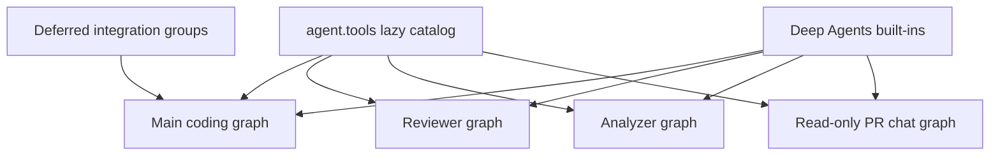
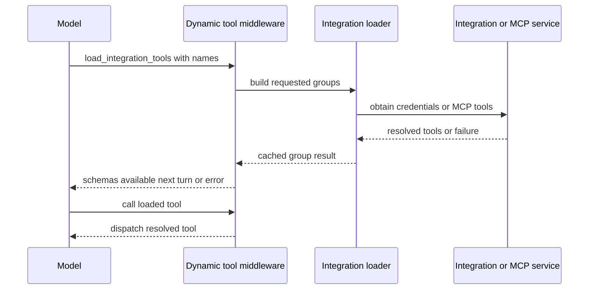

# Tool Catalog and Authorization

Open SWE does not treat the tools package as a universal capability grant. A tool must be exported, deliberately wired into a particular graph, and—where appropriate—protected again at its own boundary. This separation keeps credentials, administrative actions, and graph-specific operations out of tool surfaces that do not need them.

## Catalog versus executable surface

`agent.tools` is the curated export facade. `_TOOL_MODULES` maps public names to their implementation modules; access lazily imports and caches the export. Its module subclass deliberately prefers a public export over an identically named submodule that `importlib` placed on the package. Several names can share an implementation, such as the automation operations all drawing from `.automations`.

The facade includes local curated modules as well as selected GitHub, Linear, Slack, and incident-management tools. Exporting a name only makes it importable: each graph factory supplies its own list to `create_deep_agent`.

Deep Agents separately supplies filesystem and delegation tools: `read_file`, `write_file`, `edit_file`, `delete`, `ls`, `glob`, `grep`, `execute`, and `task`. `DEEP_AGENT_TOOL_NAMES` reserves these names, preventing static or dynamic integrations from colliding with them. The main graph hides `grep`; stop-summary mode additionally hides the mutating filesystem, shell, and delegation built-ins.

This diagram distinguishes the import catalog from the graph-specific execution surfaces; deferred integrations are attached only to eligible main-agent runs.

## Main coding agent assembly

`agent.server:get_agent` constructs the normal `static_tools` list. It includes web access (`http_request`, `fetch_url`, `web_search`); plan lifecycle (`save_plan`); background execution (`background_execute`, `background_task`); user instructions and skills (`save_user_instructions`, `save_user_skill`, `delete_user_skill`); dashboard thread operations (`list_threads`, `get_thread`, `manage_thread`); optional thread creation (`start_thread`); notifications (`notify_automation_channel`, `submit_thread_feedback`, `submit_review_assessment_feedback`); baby-sit management (`manage_baby_sit`); PR creation (`open_pull_request`, `link_pull_request`), expedited review (`expedite_pr_approval`, `merge_expedited_pr`), and Slack review request (`request_pr_review`); human reviewer management (`request_human_review`, `assign_human_reviewer`, `auto_assign_human_reviewer`, `dismiss_human_review_request`); sandbox recovery (`recreate_sandbox`); scheduling (`schedule_thread_wakeup`); safe user-settings lookup (`read_user_settings`); optional user-settings mutation (`save_user_settings`); platform-issue reporting (`report_platform_issue`); Slack tools; incident management (`manage_incident`); code-channel management (`manage_code_channel`); event listening and type listing (`listen_events`, `list_event_types`); optional Notion comment posting (`comment_on_notion_task`) and Notion design tools; and read-only SQL (`read_only_sql`). Signed sandbox helpers (`output_iframe`, `create_sandbox_file_download_url`, `expose_port`) are included only when the run configuration enables them. Admin tools (automation and workspace management) are included conditionally. CLI result logging (`cli_result`) and review approval policy management (`manage_feature_flags`, `manage_review_approval_mode`) are included for eligible surfaces.

The final list depends on trusted run context:

- An `admin_thread` receives `ADMIN_TOOLS`: automation management (`create_automation`, `update_automation`, `trigger_automation`, `delete_automation`, `list_automations`), workspace management (`list_workspaces`, `publish_workspace`, `refresh_workspace_start`, `configure_repository`, `delete_workspace`), and organization-skill mutations (`save_organization_skill`, `delete_organization_skill`). The factory accepts the flag only after checking the triggering identity against the configured administrators, so metadata cannot transfer admin capability to a later participant.
- A desktop `local_run` receives only `http_request`, `fetch_url`, and `web_search`. A `stop_summary` run initially receives only Slack thread reading and reply. In both cases, integration groups are not collected.
- Slack operations are removed unless trusted Slack context enables them. This filtering occurs after the mode-specific list is chosen.
- Slack DM mode excludes `slack_add_reaction` via `DM_EXCLUDED_TOOLS` to avoid clutter on user messages.
- Slack channel-ask mode excludes thread-bound operations (`slack_add_reaction`, `slack_attach_html`, `slack_move_thread`) and incident management via `SLACK_ASK_EXCLUDED_TOOLS`, but retains write capabilities for answering in the channel. Slack by-the-way mode additionally excludes `slack_start_new_thread`.
- Personal user-settings tools are removed when no credential login is verified (no personal identity in the thread).
- Human review tools are removed when Slack bot context is unavailable. Expedited review tools (`expedite_pr_approval`, `merge_expedited_pr`) are removed when disabled or when Slack bot context is unavailable.
- Incident-session tools are added if an incident is in scope; when incident management is automatic (not explicitly requested), additional mutations are excluded via `INCIDENT_AUTOMATIC_EXCLUDED_TOOLS`.
- The general-purpose subagent gets the applicable static list except `save_user_settings`; separately compiled subagent graphs do not inherit parent middleware. Dynamic integration middleware is explicitly passed to it.

## Deferred integration tools

Eligible normal runs construct candidate groups for MCPs (workspace and user-scoped) and Notion tools; `DynamicToolMiddleware` presents one loader, `load_integration_tools`, with the catalog of group-qualified tool names rather than placing all operational schemas on the first model call.

This is the deferred loading path: a successful loader call updates run state, so the requested schema becomes available on the next model turn.

Names must be unique across groups and must not collide with the loader, built-ins, or static tools. The middleware resets `loaded_integration_tools` at the start of each run. It uses one lock and one cached resolution per group; loading failures become an empty group and a tool error instructing the model to continue. Direct integration calls before loading receive the same kind of recoverable error.

Integration loading is also a credential boundary. Notion schemas require an `on_behalf_of` thread participant; each invocation resolves that participant and refreshes that participant's token rather than retaining one in the sandbox. MCP tools are loaded from workspace, instance, and (if a user is logged in) personal tiers, with later tiers' connections replacing earlier ones.

### Tool addition protocol

Models that accept in-conversation tool addition (Anthropic's `tool_addition` and OpenAI's `additional_tools`) receive loaded integration tools via those fields, preserving prompt cache across the load. Models without this support receive tools in the standard tools list, which invalidates cache. Model prefixes recognized: `claude-opus-5`, `claude-fable-5`, `claude-opus-4-8`, `claude-mythos-5`, `claude-sonnet-5-5` (Anthropic `tool_addition`); `gpt-6-astra`, `gpt-6.1-sol`, `gpt-6-luna` (OpenAI Responses API `additional_tools`).

## Specialist surfaces

| Graph | Curated tools and intent |
| --- | --- |
| Main | Context-dependent static tools, eligible dynamic groups, and applicable Deep Agents built-ins. |
| Reviewer | `fetch_review_diff`; finding creation, update, listing, publication, resolution, and reply (`add_finding`, `update_finding`, `list_findings`, `publish_review`, `resolve_finding_thread`, `reply_to_finding_thread`); plus `web_search`, `fetch_url`, and `http_request`. It does not receive `open_pull_request`. |
| Analyzer | Only `save_review_style_prompt` and `read_finding_outcomes`, supporting repository review-style guidance. |
| PR chat | `read_repo_file`, `search_repo_code`, `list_review_findings`, `web_search`, `fetch_url`, `propose_review_comment`, and `propose_pr_review`, with a read-only virtual-file surface. |

PR chat intentionally has no sandbox. It excludes shell and write built-ins (`execute`, `write_file`, `edit_file`, `delete`), and its delegated subagent allowlists only `read_file`, `ls`, `glob`, and `grep`. The chat preparation middleware acquires a repository-scoped GitHub App installation token for the GitHub-backed read tools; PR overview, diff, and findings are supplied as virtual `/pr/` files by the review-chat API.

## Tool-side authorization and safe responses

Graph wiring is a convenience and least-privilege measure, not the sole authorization control. `read_user_settings` takes no caller-provided user, thread, or source identifier. It derives verified participants from runtime configuration and returns mapped profile settings, instructions, connection status metadata, and an unresolved count—never connection tokens or credentials.

Automation operations repeat their authorization with `require_admin`, which checks the runtime identity. They wrap the dashboard schedule service and return structured `{ok: false, error: ...}` responses for authorization and service failures. Creation records the verified admin identity; update preserves omitted fields while rejecting simultaneous clear/set values for repository or Slack destination; test triggering is allowed for paused automations. The delete tool's contract requires user confirmation before permanent removal.

The `@access` decorator implements tool-side authorization as an independent check on a Policy object specifying where a tool may run (anywhere, private thread, admin_thread, or admin_surface), who can use it (anyone, owner, or admin), and optional result projection for sole writers. The decorator rechecks authorization at runtime, applies sole-writer projection when appropriate, and returns a refused error if the current run's Access mode does not permit the tool.

This pattern is required for tools with sensitive side effects: validate trusted runtime identity and resource scope inside the tool, do not rely on model arguments or thread metadata, and turn anticipated operational failures into actionable tool results.

## Mode-specific tool gating

Tool exclusion is applied per-mode after the static list is determined, using `ExcludeToolsMiddleware` to remove context-inappropriate tools after Deep Agents injects built-ins:

- **Stop-summary mode** (`STOP_SUMMARY_EXCLUDED_TOOLS`) removes filesystem mutation (`write_file`, `edit_file`, `delete`), shell execution (`execute`), delegation (`task`), and `grep`, leaving only Slack read/reply tools available.
- **Slack channel-ask mode** (`SLACK_ASK_EXCLUDED_TOOLS`) removes thread-bound Slack operations (`slack_add_reaction`, `slack_attach_html`, `slack_move_thread`) and incident management, but retains write capabilities for answering in the channel. Slack by-the-way mode additionally excludes `slack_start_new_thread`.
- **Slack DM mode** (`DM_EXCLUDED_TOOLS`) removes `slack_add_reaction` to avoid clutter on user messages.
- **Incident automatic mode** (`INCIDENT_AUTOMATIC_EXCLUDED_TOOLS`) removes mutable operations when an incident sweep runs without explicit request, preventing unintended side effects.
- **PR chat** (`_EXCLUDED_TOOLS`) removes `execute`, `write_file`, `edit_file`, and `delete` to ensure read-only operation.

## Safely extending a tool

1. Implement an async tool in `agent/tools/`, map it in `_TOOL_MODULES`, and add its type-checking export.
2. Wire it only into the graph(s) that need it. Decide whether desktop, stop-summary, Slack, admin-thread, or subagent filtering applies.
3. Reserve the name against Deep Agents built-ins and static/dynamic integration names. For expensive or credentialed integrations, use an `IntegrationGroup` and make loading failure recoverable.
4. Put authorization and scope checks at the tool boundary; derive actor and resource identity from trusted runtime context where possible. Keep secrets server-side and return redacted status/error data.
5. Add focused behavior tests: catalog/graph composition and mode filtering, authorization denial, credential/scope handling, success and failure results, and mode-specific exclusion for each new mutation.

## Related pages

- [Agent graph](../architecture/agent-graph.md) — graph factories and runtime assembly.
- [Reviewer and analyzer](../architecture/reviewer-and-analyzer.md) — specialist graph responsibilities.
- [Authorization and security](auth-and-security.md) — trust boundaries and credentials.
- [Observability and MCP](../integrations/observability-and-mcp.md) — integration configuration.
- [PR creation](../workflows/pr-creation.md) — PR workflow behavior.
