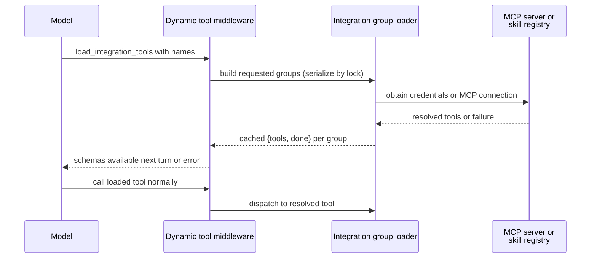

# Tool Ecosystem and Dynamic Loading

Open SWE does not treat the tools package as a universal capability grant. A tool must be exported from the curated catalog, deliberately wired into a particular graph, and—where appropriate—protected at its own boundary with access policies. This separation keeps credentials, administrative actions, and graph-specific operations out of tool surfaces that do not need them.

## Tool catalog structure

`openswe.tools` is the curated export facade. `_TOOL_MODULES` maps public names to their implementation modules; access lazily imports and caches the export. Its module subclass deliberately prefers a public export over an identically named submodule that `importlib` placed on the package. Several names can share an implementation, such as the automation operations all drawing from `.automations`.

The catalog includes local curated modules as well as selected GitHub, Linear, Slack, and incident-management tools. Exporting a name only makes it importable: each graph factory supplies its own list to `create_deep_agent`.

Deep Agents separately supplies filesystem and delegation tools: `read_file`, `write_file`, `edit_file`, `delete`, `ls`, `glob`, `grep`, `execute`, and `task`. `DEEP_AGENT_TOOL_NAMES` reserves these names, preventing static or dynamic integrations from colliding with them. The main graph hides `grep`; stop-summary mode additionally hides the mutating filesystem, shell, and delegation built-ins.

<!-- openwiki: mermaid parse failed and this diagram was converted to a text fence so it does not break rendering. Fix the diagram source and restore the mermaid fence. Parser error: Heuristic: an unescaped angle bracket inside a label breaks rendering; rephrase the label. -->
```text
flowchart TD
    Catalog["openswe.tools lazy catalog"]
    Main["Main coding graph"]
    Reviewer["Reviewer graph"]
    Analyzer["Analyzer graph"]
    Chat["Read-only PR chat graph"]
    Builtins["Deep Agents built-ins"]
    Deferred["Deferred integration groups<br/>(MCPs, Notion, workspace skills)"]

    Catalog -->|static tools| Main
    Catalog -->|static tools| Reviewer
    Catalog -->|static tools| Analyzer
    Catalog -->|static tools| Chat
    Builtins -->|filesystem, exec, task| Main
    Builtins -->|filesystem, exec, task| Reviewer
    Builtins -->|filesystem, exec, task| Analyzer
    Builtins -->|filesystem, read-only| Chat
    Deferred -->|lazy-loaded on call| Main
```

This diagram distinguishes the curated import catalog from graph-specific execution surfaces; deferred integrations are attached only to eligible main-agent runs.

## Main coding agent assembly

`openswe.server:get_agent` constructs the main agent's `static_tools` list. It includes:

- **Web access** (`http_request`, `fetch_url`, `web_search`)
- **Planning** (`save_plan`)
- **Background execution** (`background_execute`, `background_task`)
- **User instructions and skills** (`save_user_instructions`, `save_user_skill`, `delete_user_skill`)
- **Thread operations** (`list_threads`, `get_thread`, `manage_thread`, optionally `start_thread`)
- **PR creation and updates** (`open_pull_request`, `link_pull_request`, `search_pull_requests`)
- **PR review workflow** (`expedite_pr_approval`, `merge_expedited_pr`, `request_pr_review`)
- **Human reviewer management** (`request_human_review`, `assign_human_reviewer`, `auto_assign_human_reviewer`, `dismiss_human_review_request`, `get_human_review_status`)
- **Notifications** (`notify_automation_channel`, `submit_thread_feedback`, `submit_review_assessment_feedback`)
- **Baby-sit management** (`manage_baby_sit`)
- **Sandbox recovery** (`recreate_sandbox`)
- **Scheduling** (`schedule_thread_wakeup`)
- **User-settings lookup** (`read_user_settings`) and optional mutation (`save_user_settings`)
- **Platform support** (`report_platform_issue`)
- **Slack tools** (reactions, thread moves, message posting, etc.)
- **Incident management** (`manage_incident`)
- **Code-channel management** (`manage_code_channel`)
- **Event operations** (`listen_events`, `list_event_types`)
- **Optional Notion integrations** (`comment_on_notion_task`, design tools)
- **SQL query** (`read_only_sql`)
- **Sandbox downloads** (`output_iframe`, `create_sandbox_file_download_url`, `expose_port`, when enabled)
- **Admin operations** (automation and workspace management, conditionally included)
- **CLI result logging** (`cli_result`, when required for CLI mode)
- **Review approval policy** (`manage_feature_flags`, `manage_review_approval_mode`)

Tool inclusion depends on runtime context:

- An `admin_thread` receives `ADMIN_TOOLS` (automation management, workspace management, organization-skill mutations). The factory verifies the triggering identity against configured administrators before adding these, so metadata cannot grant admin capability to later participants.
- A desktop `local_run` collapses to only `http_request`, `fetch_url`, and `web_search`. Integration groups are not collected.
- A `stop_summary` run initially gets only `slack_read_thread_messages` and `slack_reply`. Integration groups are not collected.
- Slack operations are conditionally removed unless trusted Slack context enables them. Channel-ask mode and by-the-way mode use `SLACK_ASK_EXCLUDED_TOOLS` and `SLACK_BY_THE_WAY_EXCLUDED_TOOLS` to remove thread-bound and incident operations while retaining write capabilities.
- Slack DM mode excludes `slack_add_reaction` via `DM_EXCLUDED_TOOLS` to avoid clutter on user messages.
- Personal user-settings tools are removed when no credential login is verified (no personal identity in the thread).
- Human review tools are removed when Slack bot context is unavailable. Expedited review tools are removed when disabled or when Slack bot context is unavailable.
- Incident-session tools are added if an incident is in scope; when incident management is automatic (not explicitly requested), additional mutations are excluded via `INCIDENT_AUTOMATIC_EXCLUDED_TOOLS`.
- The general-purpose subagent gets the applicable static list except `save_user_settings`; separately compiled subagent graphs do not inherit parent middleware. Dynamic integration middleware is explicitly passed to it.

## Deferred integration tool loading

Eligible normal runs construct candidate groups for MCPs (workspace, instance, and personal-tier scoped) and workspace skills. `DynamicToolMiddleware` presents a single loader, `load_integration_tools`, with a catalog of group-qualified tool names rather than placing all schemas on the first model call.



This deferred loading path works as follows: a successful loader call updates run state, so the requested schema becomes available on the next model turn. Names must be unique across groups and must not collide with the loader, built-ins, or static tools. The middleware resets `loaded_integration_tools` at the start of each run, uses one lock and one cached resolution per group (both success and failure), and returns tool errors rather than failing the run when loading fails.

Integration loading is also a credential boundary. Workspace-scoped MCP tools load from workspace, instance, and (if a user is logged in) personal tiers, with later tiers' connections replacing earlier ones. All tool invocations receive a fresh credential check at runtime.

### Tool addition protocol

Models that support in-conversation tool addition (Anthropic's `tool_addition` and OpenAI's `additional_tools`) receive loaded integration tools via those fields to preserve prompt cache. Models without this support receive tools in the standard tools list, which invalidates cache. Model prefixes recognized:

- **Anthropic** (`tool_addition`): `claude-opus-5`, `claude-fable-5`, `claude-opus-4-8`, `claude-mythos-5`, `claude-sonnet-5-5`
- **OpenAI Responses API** (`additional_tools`): `gpt-6-astra`, `gpt-6.1-sol`, `gpt-6-luna`

## Specialist agent surfaces

| Graph | Curated tools and intent |
| --- | --- |
| Main | Context-dependent static tools, eligible dynamic groups (MCPs, workspace skills), and applicable Deep Agents built-ins. Resolves access policies and excludes tools based on run mode. |
| Reviewer | `fetch_review_diff`; finding operations (`add_finding`, `update_finding`, `list_findings`, `publish_review`, `resolve_finding_thread`, `reply_to_finding_thread`); plus `web_search`, `fetch_url`, and `http_request`. Does not receive `open_pull_request`. |
| Analyzer | Only `save_review_style_prompt` and `read_finding_outcomes`, supporting repository review-style guidance with a model-call limit. |
| PR chat | `read_repo_file`, `search_repo_code`, `list_review_findings`, `web_search`, `fetch_url`, `propose_review_comment`, and `propose_pr_review`, with a read-only virtual-file surface seeded via `/pr/` paths. |

PR chat has **no sandbox**. It excludes shell and write built-ins (`execute`, `write_file`, `edit_file`, `delete`), and its delegated subagent allowlists only `read_file`, `ls`, `glob`, and `grep`. The chat preparation middleware acquires a repository-scoped GitHub App installation token for the GitHub-backed read tools; PR overview, diff, and findings are supplied as virtual `/pr/` files by the review-chat API.

## Tool-side authorization and safe responses

Graph wiring is a convenience and least-privilege measure, not the sole authorization control. The `@access` decorator implements independent tool-side authorization as a check against a `Policy` object specifying:

- **Where the tool may run**: `anywhere`, `private` (private thread only), `admin_thread`, or `admin_surface`
- **Who can use it**: `anyone`, `owner` (the sole writer in a private thread), or `admin`
- **Result projection for sole writers**: an optional `Projection` callable that redacts full results when the thread is shared

The decorator rechecks authorization at runtime, applies projection when appropriate, and returns a refused error if the current run's `Access` mode does not permit the tool.

`read_user_settings` derives verified participants from thread configuration and returns mapped profile settings, instructions, and redacted connection status metadata without tokens or credentials. It takes no caller-provided user, thread, or source identifier.

Automation operations repeat their authorization with `require_admin`, which checks the runtime identity or (for scheduled runs) whether a saved admin authorized the schedule. They wrap the dashboard schedule service and return structured `{ok: false, error: ...}` responses for authorization and service failures rather than propagating exceptions. Creation records the verified admin identity; update preserves omitted fields while rejecting simultaneous clear/set values for repository or Slack destination; test triggering is allowed for paused automations.

## Mode-specific tool gating

Tool exclusion is applied per-mode after the static list is determined, using `ExcludeToolsMiddleware` to remove context-inappropriate tools after Deep Agents injects built-ins:

- **Stop-summary mode** (`STOP_SUMMARY_EXCLUDED_TOOLS`) removes filesystem mutation (`write_file`, `edit_file`, `delete`), shell execution (`execute`), delegation (`task`), and `grep`, leaving only Slack read/reply tools available.
- **Slack channel-ask mode** (`SLACK_ASK_EXCLUDED_TOOLS`) removes thread-bound Slack operations (`slack_add_reaction`, `slack_attach_html`, `slack_move_thread`), incident management (`manage_code_channel`, `manage_incident`), and `grep`, but retains write capabilities for answering in the channel. Slack by-the-way mode additionally excludes `slack_breakout_thread`.
- **Slack DM mode** (`DM_EXCLUDED_TOOLS`) removes `slack_add_reaction` to avoid clutter on user messages.
- **Incident automatic mode** (`INCIDENT_AUTOMATIC_EXCLUDED_TOOLS`) removes mutable operations when an incident sweep runs without explicit user request, preventing unintended side effects and enforcing read-only analysis during automatic incident assessment.
- **PR chat** (`_EXCLUDED_TOOLS`) removes `execute`, `write_file`, `edit_file`, and `delete` to ensure read-only operation over GitHub-backed read tools.

## Tool error handling and recovery

The `tool_error_handler` middleware catches malformed tool calls that reference unknown tools, tools with mismatched argument types, or tools that are not available in the current mode. It repairs simple cases (e.g., correcting known aliases or suggesting similar names) and returns recoverable errors as tool messages so the model may retry or continue.

## Safely extending a tool

1. Implement an async tool in `openswe/tools/`, map it in `_TOOL_MODULES`, and add its type-checking export in `__all__`.
2. Wire it only into the graph(s) that need it. Decide whether desktop, stop-summary, Slack, admin-thread, or subagent filtering applies.
3. Reserve the name against Deep Agents built-ins and static/dynamic integration names. For expensive or credentialed integrations, use an `IntegrationGroup` and make loading failure recoverable.
4. Declare access policies with `@access(Policy(...))` if the tool has sensitive side effects or must run in specific thread contexts. Derive actor and resource identity from trusted runtime context where possible. Keep secrets server-side and return redacted status/error data.
5. Add focused behavior tests: catalog/graph composition and mode filtering, authorization denial, credential/scope handling, success and failure results, and mode-specific exclusion for each new mutation.

## Related pages

- [Agent graph](../architecture/agent-graph.md) — graph factories and runtime assembly.
- [Reviewer and analyzer](../architecture/reviewer-and-analyzer.md) — specialist graph responsibilities.
- [Authorization and security](auth-and-security.md) — trust boundaries and credentials.
- [Observability and MCP](../integrations/observability-and-mcp.md) — integration configuration.
- [PR creation](../workflows/pr-creation.md) — PR workflow behavior.
