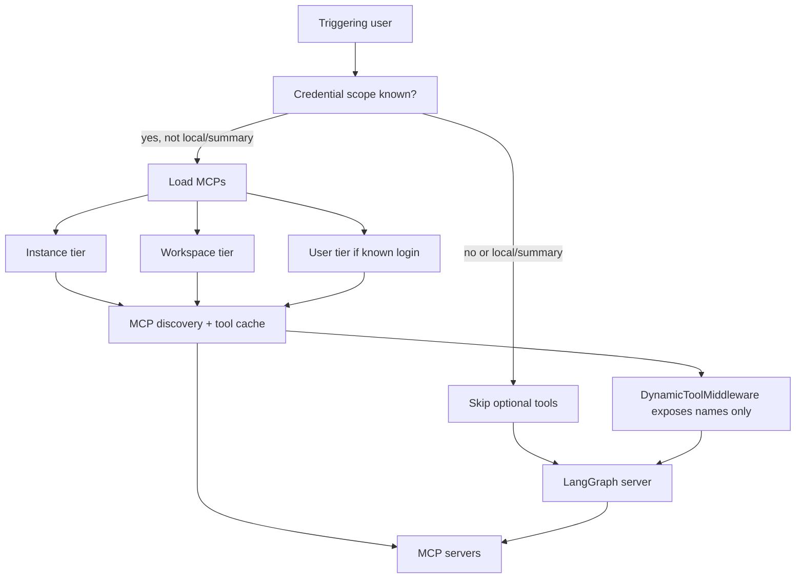

# Observability, Tracing, and MCP

The agent combines three observability and integration systems:

1. **LangSmith tracing and cost collection**: Every run is traced to LangSmith for debugging, inspection, and model-call cost attribution. Trace resource names are set by APM middleware, and trace URLs are generated for dashboard embedding and user review context.

2. **Analytics event capture**: Invocation starts, completions, failures, and deferred cost updates flow through a fail-soft event system backed by PostgreSQL. Session costs track per-workspace usage for attribution.

3. **Extensible integrations**: MCP (Model Context Protocol) connections are scoped by instance, workspace, and user; Notion is a built-in participant-scoped integration. Both are optional—missing credentials or connection failures remove optional tools rather than blocking a run.

Additionally, the system maintains a **full append-only transcript** for debugging, replay, and audit purposes, and wraps middleware with tracing policies that omit sensitive input payloads.

See [Authentication and security](../concepts/auth-and-security.md) for the broader trust model, [Tools](../concepts/tools.md) for dynamic tool availability, [Models, profiles, and instructions](../concepts/models-profiles-instructions.md) for model selection, and [Configuration](../operations/configuration.md) for environment settings.

## LangSmith tracing and APM instrumentation

Every agent run is traced to [LangSmith](https://www.langsmith.com) for inspection, debugging, and model-call cost attribution. The tracing system provides:

- **Trace resource naming**: `agent/api/tracing.py` defines `TraceResourceNameMiddleware`, which renames APM spans after the route that handled each request. Since the platform instruments the server at a higher level, dashboard requests would otherwise land on a single generic resource. The middleware captures the route path and method (e.g., `GET /api/mcp/instance`) so traces can be searched, compared, and alerted on by endpoint.

- **Middleware trace policies**: `agent/middleware/trace.py` provides `OpenSWEMiddleware`, a base class for all agent middleware that enforces `SCRUBBED_TRACE_POLICY`, which omits input payloads from traces to protect sensitive data. The `scrub_middleware_inputs` helper applies this policy to any traceable middleware before registration.

- **Trace URL generation**: `agent/utils/langsmith.py:get_langsmith_trace_url` builds LangSmith dashboard URLs for embedding in dashboard context blocks and for user review. It resolves the tenant ID and project ID once per workspace and caches them; it returns `None` if LangSmith is not configured. This provides a best-effort link that works even if tracing is misconfigured; it does not fail the run.

LangSmith integration requires `LANGSMITH_API_KEY` and `LANGSMITH_ENDPOINT` environment variables, with optional `LANGSMITH_TENANT_ID` to bypass discovery.

## Cost collection and deferred enrichment

After a run completes, cost is enriched and tracked by two independent systems:

### Invocation cost tracking

`agent/agent_cost.py:finalize_agent_invocation_usage` records terminal invocation usage and schedules deferred cost collection:

1. **Immediate recording** of completion status and model-call token counts (input, output, total) via `record_agent_invocation_completion`.
2. **Cost refresh scheduling** with bounded retries at delays (15, 30, 60, 120, 240 seconds) if cost is not immediately available from LangSmith.

The refresh function `run_agent_cost_refresh` queries LangSmith thread stats to retrieve total invocation cost, correlating by `invocation_id` or `prepare_run_id` metadata, then stores the cost via `record_agent_invocation_cost`. If cost retrieval fails with a 4xx error (except 408/429), the error is treated as terminal and no further retries are scheduled; otherwise, timeouts and 5xx errors schedule the next attempt.

### Session cost tracking

`agent/session_cost.py` tracks cumulative per-workspace usage and posts deferred cost updates to Slack replies. Each Slack run has a mapped final reply message; when session cost becomes available, the bot updates the message to display total cost and token usage. Like invocation costs, session cost refresh is scheduled with bounded retries, but it also marks the Slack message with a pending-cost indicator before the cost is known.

### Analytics event capture

`agent/analytics/usage.py` captures product lifecycle events into PostgreSQL:

- **`record_agent_invocation_usage`**: Logs when a run starts, with model ID, effort level, source entry point, and user identity.
- **`record_agent_invocation_completion`**: Logs terminal status (success, failure, timeout, or cancellation), failure code, and token counts.
- **`record_agent_invocation_cost`**: Emits the `run.cost_recorded` event when cost becomes available.

Events are queued via `agent/analytics/emitter.py` with fail-soft semantics: failures to persist analytics never block the run. Events carry an opaque `workspace_id` for multi-tenant attribution and are stored in an outbox table for asynchronous delivery.

## Transcript recording

`agent/middleware/transcript.py` captures a complete append-only transcript of every run for debugging, replay, and audit purposes. One middleware instance serves all runs; per-run state lives in a module-level registry keyed by `thread_id:run_id`. Transcripts are written by a background task so the model stream never waits on database I/O.

The transcript captures:

- **Turn lifecycle events**: request, start, completion, interruption, failure.
- **Message events**: each agent message, human message, and tool message with sender identity, attachments, and usage (tokens).
- **Tool lifecycle**: tool calls with invocation details and results (truncated to 256 KiB and stripped of sensitive data).
- **Reasoning blocks**: expanded reasoning and internal thinking from advanced models like Claude Sonnet 4.

Events are queued and flushed asynchronously by a writer per run, with soft-buffer boundaries at paragraph breaks and hard boundaries at 24 KB. Failures to write transcripts are logged but never fail the run, so transcript problems are observability-only.

## MCP connection scoping and discovery

MCP connections are organized in a three-tier hierarchy: **instance** (globally managed by deployment admins), **workspace** (managed by workspace admins per slug), and **user** (personal connections owned by an individual GitHub login). When loading tools for a run, all three tiers are consulted in order; a later tier's connection with the same name replaces the earlier one.

- **Instance tier** (`agent/mcp/instance.py`): Connections stored in `["instance_mcps"]` that every run can access. The tier adopts and migrates pre-workspace records from the flat `["workspace_mcps"]` namespace on first read, ensuring backward compatibility.
- **Workspace tier** (`agent/mcp/workspace.py`): Connections stored under `["workspace_mcps", <slug>]`, where `<slug>` is the lowercase workspace identifier. Each workspace has its own set of connections.
- **User tier** (`agent/mcp/user.py`): Personal connections stored under `["user_mcps", <login>]`, scoped to a GitHub login and visible only in runs where that login is the triggering user.

Each tier exposes its own admin UI route for creation, validation, token refresh, and discovery. A connection is a reusable MCP server reference with a name, URL, transport (streamable_http or SSE), optional headers (including OAuth token URLs and client secrets), and an optional allowlist of tool names to expose. Stored tokens are encrypted at rest with `agent.encryption`.

## Tool loading and availability

The server loads MCP tools during agent assembly for non-summary, non-local runs with a known credential scope. It loads the three tiers via `load_mcp_tools(*sources)` in `agent/mcp/runtime.py`, which walks each source's connection list, discovers tool definitions, and builds runnable tools. The `DynamicToolMiddleware` exposes only tool *names* initially and defers the MCP handshake (which may fail, timeout, or be expensive) until the agent explicitly calls `load_integration_tools` and requests to use them. This lazy strategy avoids blocking the first model call when MCP availability is uncertain.

Tool loaders use a stale-while-revalidate TTL cache (300 seconds for most tiers, 600 for expensive operations) and enforce a per-load timeout. An exception, timeout, or missing credentials returns an empty tool list rather than failing the run. Reads on the tool-loading path are fail-soft: if the Store backend is unreachable, the run continues without those tools, whereas dashboard status reads surface Store failures.

MCP tool loading flow: credential scope gates tool loading, then instance, workspace, and user tiers are consulted in order and combined before exposure to the agent via DynamicToolMiddleware.

## Notion integration

Notion is a built-in, participant-scoped MCP integration backed by the hosted server at `https://mcp.notion.com/mcp` using per-user OAuth access tokens. Unlike the general MCP tiers, Notion tools are always participant-scoped: each tool invocation must include an `on_behalf_of` parameter naming the GitHub login of the person whose Notion connection to use.

### Notion OAuth and credential lifecycle

The `agent/dashboard/notion_oauth.py` module orchestrates discovery and exchange with Notion's OAuth authorization server. The agent stores one encrypted Notion record per user under `["user_credentials", <login>, "notion"]`, containing:

- **Encrypted access token** (`encrypted_access_token`): The current bearer token for the Notion MCP server.
- **Encrypted refresh token** (`encrypted_refresh_token`): A long-lived token to refresh the access token without re-authorization.
- **Token expiry** (`token_expires_at`, `refresh_token_expires_at`): ISO timestamps used to determine whether proactive refresh is needed.
- **OAuth flow metadata** (`client_id`, `token_endpoint`, `encrypted_client_secret`): Credentials to perform refresh operations.
- **Timestamps** (`updated_at`): When the record was last modified.

Token expiry is checked with a 300-second skew before a call to allow proactive refresh. If the access token is expired and a refresh token exists, `refresh_notion_access_token` is called under a per-login lock to avoid concurrent refresh races. If the refresh fails with a 401/403 (indicating the token is dead), the connection is dropped and a reconnect is required. If the access token is missing or non-refreshable, the tool call fails.

### Notion tool discovery and wrapping

`load_notion_tools(login)` loads only the private thread owner's Notion tools and only if they have a valid Notion connection. It uses that login's access token to call `_build_mcp_tools` once, discovering the MCP catalog. Every discovered tool is then wrapped in a `_RefreshingNotionMCPTool`, which adds a required `on_behalf_of` input parameter to every tool's schema. The wrapped tool is stateless: its schema is the same for all runs and all participants, reflecting the Notion MCP's catalog at discovery time, not a specific user's authorization.

At invocation, the wrapper:

1. Extracts the `on_behalf_of` parameter from the input.
2. Resolves the participant via `resolve_participant`, ensuring they match the triggering user and are a verified thread participant.
3. Fetches a fresh access token for that participant.
4. Rebuilds the MCP tool by calling `_build_mcp_tools` with the fresh token.
5. Invokes the tool.

If the participant is not found, the token is missing (no Notion connection), or the refresh fails, a `RuntimeError` is raised and the tool invocation fails. This design ensures tool invocations cannot use one person's Notion connection to act as another, and each call gets a current token even if previous calls expired it.

### Participant invariant

All uses of `on_behalf_of` are validated by `resolve_participant` in `agent/utils/thread_participants.py`. The parameter must be:

- Nonempty and case-insensitively match the GitHub login that triggered the current run.
- Among the verified participants of the thread (resolved by reading Slack, GitHub, and Linear message history).
- Uncertainty while verifying participants is rejected rather than silently accepted.

This invariant prevents the agent from using one person's credentials to act as a different, untrusted thread participant.

## Tool loading lifecycle and failures

While assembling a non-local, non-summary agent, the server concurrently loads:

- **MCP tools** from instance, workspace, and user tiers using `_mcp_tools_for`.
- **Notion tools** for the triggering login using `_notion_tools_for`, only if the run has a known credential scope.

Summary-stop and local/desktop runs skip optional tool loading. Both loaders are wrapped in a TTL cache and timeout, returning an empty list on failure. The server then registers each tool group with `DynamicToolMiddleware`, which defers the MCP handshake. The agent can call `load_integration_tools` to load a group by name and begin using its tools.

The operational invariant is that optional tool loss reduces available tools, not the ability to start or complete a run. If all MCPs are unavailable, the agent continues without them. If Notion is unavailable, the run has no Notion tools but is not blocked.

## Operational safeguards and observability invariants

The combination of these systems enforces key invariants:

- **No observability blocking**: LangSmith cost collection, analytics capture, and transcript writing use fail-soft patterns so failures are logged but never block a run or cause a visible error to the user.
- **Lazy tool availability**: MCP handshakes are deferred until explicitly requested, so unavailable or slow integrations do not block the first model call.
- **Trace isolation**: Middleware trace policies omit sensitive input payloads from traces, and trace resource naming happens at the middleware boundary so platform-level APM can properly instrument routes.
- **Cost attribution**: Session costs and invocation costs are tracked independently with bounded-retry scheduling, ensuring cost data eventually reaches Slack replies and analytics even if LangSmith is temporarily unavailable.

## Focused verification

Relevant tests cover:

- **LangSmith integration**: Trace URL generation and cost lookup in tests under `tests/utils/`.
- **Analytics capture**: Event queueing and invocation lifecycle in `tests/analytics/`.
- **MCP loading**: Tool loading and caching in `tests/tools/test_mcp_sources.py` and `tests/tools/test_workspace_mcp_tools.py`; tier consultation and connection discovery in `tests/tools/test_mcp_oauth.py`.
- **Notion integration**: Wrapper refresh and participant validation in `tests/tools/test_notion_mcp_tools.py`.
- **Concurrent assembly**: Factory-level tool loading in `tests/agent/test_factory_tool_loading.py`.
- **Transcript recording**: Transcript lifecycle and event flushing in tests under `tests/middleware/transcript/` and `tests/transcript/`.
