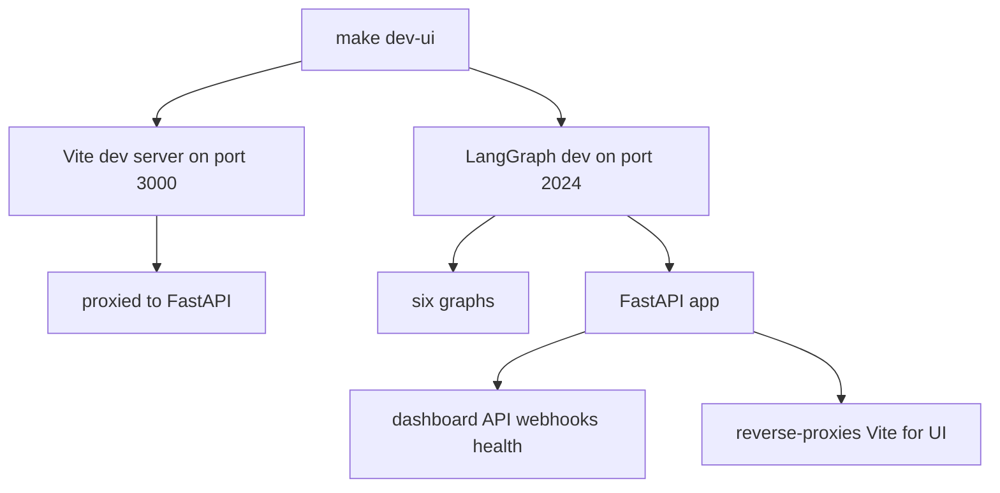
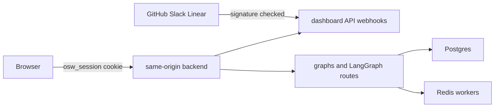

# Deployment and Runtime

Open SWE is deployed as a single LangGraph application: six registered graphs (`agent`, `reviewer`, `analyzer`, `review-scout`, `chat`, `scheduler`) plus the FastAPI application (`agent.webapp:app`), wired through `langgraph.json`, which declares the Python version, LangGraph API version, registered graphs, checkpointer TTL policy, and dashboard bundle instructions. The same origin serves the LangGraph API (`/threads`, `/runs`, `/assistants`, `/store`), the FastAPI dashboard API (`/dashboard/api/*`), webhook endpoints (`/webhooks/*`), and the bundled dashboard UI.

## Architecture and configuration

The deployment topology is determined by environment variables and the manifest. See [Configuration](configuration.md) for the complete env contract, [Dashboard UI](../integrations/dashboard-ui.md) for UI behavior, and [Invocation](../workflows/invocation.md) for how requests become runs.

**Startup sequence:**

1. **Database setup:** FastAPI lifespan starts, validates configuration, runs SQLAlchemy migrations on `POSTGRES_URI`, and creates the `open_swe_analytics` schema.
2. **Data imports:** LangGraph Store migrations (workspace and user mappings) are applied; any pre-migration workspaces/users in the Store are moved to Postgres.
3. **Admin sync:** Admin flags are synced from `CONFIGURED_ADMINS` into the user table.
4. **Analytics activation:** Workspace records are loaded, reporting metadata is initialized.
5. **Background workers:** A pooled analytics event worker starts (reads the Store, writes to Postgres).
6. **Listeners:** Transcript and sandbox-bridge listeners start (handle multi-replica notifications).
7. **Ready:** LangGraph runtime opens all registered graphs and serves requests.

Startup failures in imports, analytics, or listeners (steps 2, 4, 5, 6) do not prevent the server from running; they log warnings and continue. The dashboard and API remain available, but dashboard features depending on those subsystems may degrade.

## Local serving modes

### Installation

Install backend dependencies with:

```bash
make install
```

This runs `uv sync --extra dev` and installs the project in development mode. The local Python runtime uses `langgraph-api>=0.15.0rc1,<0.16` and `langgraph-runtime-inmem>=0.35.0rc1,<0.36` (set in `pyproject.toml` constraints).

### Full development server

```bash
make dev
```

This executes `uv run langgraph dev --no-browser --port 2024 --n-jobs-per-worker 10`. The server runs all six graphs and the FastAPI app on `http://localhost:2024`. `langgraph.json` is the manifest: it selects Python 3.14 and LangGraph API `>~=0.15.0rc1`, registers the six graphs and FastAPI app, and configures the checkpointer (a 60-minute checkpoint sweep interval with a 43,200-minute—30 day—TTL for deletion). The manifest also loads `.env` from the repository root.

A local PostgreSQL 16 container (`open-swe-postgres`) is started automatically unless `POSTGRES_URI` is already set. The container binds to loopback only (127.0.0.1:5433) and persists data in the `open-swe-postgres` named volume, so stopping the container preserves workspace and user data across restarts.

### FastAPI only

```bash
make run
```

This executes `uv run uvicorn agent.webapp:app --reload --port 8000`. It serves only the FastAPI app (webhooks, dashboard API, bundled UI) without the LangGraph runtime. This is useful for HTTP-only development, but dashboard features that create runs require `make dev`.

### UI development with hot reload

```bash
make dev-ui
```

This starts the dashboard Vite dev server on port 3000 and the LangGraph backend on port 2024 together with `-j2` parallelism. The backend receives `DASHBOARD_DEV_SERVER_URL=http://localhost:3000` and reverse-proxies non-reserved UI requests to it. Browser navigations stay on `http://localhost:2024` (the FastAPI origin), so API calls, login callbacks, and cookies work without cross-origin setup. The UI's HMR WebSocket connects directly to Vite's port.



### Dashboard asset building

Before starting a backend that should serve the dashboard, build it:

```bash
make build-dashboard
```

This installs the frozen pnpm workspace and builds the `open-swe-dashboard` package into `ui/.output/public`. The backend discovers that directory by default (or an explicit `DASHBOARD_STATIC_DIR`) and serves the shell at non-reserved HTML routes. It deliberately declines `/dashboard/api`, `/webhooks`, `/health`, and LangGraph-owned prefixes (`/threads`, `/runs`, `/assistants`, `/store`, `/mcp`, `/a2a`, `/ui`, `/docs`, `/openapi.json`, `/info`, `/metrics`, `/ok`), so the catch-all cannot shadow API endpoints. Hashed assets are immutable-cacheable with `Cache-Control: public, max-age=31536000, immutable`, while the shell is revalidated with `no-cache` so a new build can refer to new asset hashes.

## Webhooks during local development

`langgraph dev` does not authenticate raw LangGraph API routes. Do not expose port 2024 wholesale. Use ngrok with a traffic policy:

```bash
make tunnel NGROK_DOMAIN=<name>.ngrok-free.dev
```

This runs ngrok against port 2024 with `examples/ngrok/webhooks-only.yml`; the policy returns 404 for every path except `/webhooks/*`. GitHub, Slack, and Linear can deliver to the public hostname while dashboard and LangGraph access stay local. Any other tunnel is acceptable only if it provides an equivalent allowlist.

Point integration settings at the public webhook paths (e.g., `/webhooks/github`, `/webhooks/slack`, `/webhooks/linear`) and use the localhost URL where the dashboard is opened for the GitHub OAuth callback. Restart `make dev` after changing `.env`: it reloads code but not environment variables.

## Dashboard mount-prefix invariant

The dashboard build's base path must equal the LangGraph `http.mount_prefix` at which the backend serves it. `DASHBOARD_BASE_PATH` controls Vite's asset base and router. For a local server:

```bash
DASHBOARD_BASE_PATH=/prefix/ make build-dashboard
make dev
```

Set `LANGGRAPH_URL` to the same prefixed URL. The LangGraph Platform manifest automatically extracts `http.mount_prefix` during its image build and supplies the corresponding build value. A mismatch causes client routes or asset URLs to point outside the mounted application.

## Production backend

There are two supported backend delivery paths:

### LangGraph Platform

Connect the repository in LangSmith Deployments. `langgraph.json` includes `dockerfile_lines` that perform a best-effort dashboard build for the platform image; a dashboard-build failure is logged but does not prevent backend deployment. The platform:

- Injects `LANGSMITH_API_KEY`, tracing, and project values
- Performs the dashboard build with the `http.mount_prefix` from the manifest
- Continues backend deployment even if the UI build fails
- Hosts the deployment on a `*.langgraph.app` URL

### Standalone Docker

Build with:

```bash
docker build -t open-swe .
```

The root `Dockerfile` uses the `langchain/langgraph-api:0.13.3-py3.14` base image, installs the repository with `uv`, bakes the six graph registrations into `LANGSERVE_GRAPHS`, the FastAPI app into `LANGGRAPH_HTTP`, and checkpointer settings into `LANGGRAPH_CHECKPOINTER`, and exposes port 8000.

For a standalone server, provide:

- **Database:** `DATABASE_URI` (Postgres) and `REDIS_URI` (Redis) for Agent Server backing services
- **Authentication:** `LANGSMITH_API_KEY` and `LANGGRAPH_CLOUD_LICENSE_KEY`
- **Public URL:** `LANGGRAPH_URL` set to the backend's public URL for webhook callbacks and API navigation
- **Dashboard:** Either build `ui/.output/public` before `docker build`, or set `DASHBOARD_STATIC_DIR` to a built dashboard directory

Do not use scale-to-zero hosting: background runs rely on Redis- and Postgres-backed workers staying available.

**Authentication modes:**

The standalone image defaults to `LANGGRAPH_AUTH_TYPE=noop`, which leaves raw LangGraph routes (`/threads`, `/runs`, `/assistants`, `/store`) open to any network client. Dashboard sessions (cookie) and webhook signatures do not secure these endpoints. Use:

- `LANGGRAPH_AUTH_TYPE=langsmith` with `LANGSMITH_AUTH_ENDPOINT` and `LANGSMITH_TENANT_ID` to require a LangSmith API key on every LangGraph API call
- Private networking or an authenticated gateway for network boundary protection



The default production topology keeps browser traffic and webhook delivery on one public origin.

When public URLs change, update `LANGGRAPH_URL`, webhook targets, and the GitHub callback (`<dashboard API base>/dashboard/api/auth/callback`). `DASHBOARD_BASE_URL` and `DASHBOARD_API_BASE_URL` default to `LANGGRAPH_URL` when the backend serves a bundled build or fronts Vite, so they are not needed when serving from the same origin.

## Separate dashboard deployment

A separate dashboard is optional. The `ui/Dockerfile` is a multi-stage Node 24 Alpine build (run from the repo root with `docker build -f ui/Dockerfile .`). It:

1. **Build stage:** Installs the frozen pnpm workspace, builds `open-swe-dashboard` into `ui/.output/public`
2. **Runtime stage:** Copies the `.output` directory, runs Nitro as user `node` on port 8080

The image reads `DASHBOARD_API_URL` for each request, not at build time, so one image can front different backends. The production handler throws if `DASHBOARD_API_URL` is unset.

**Backend proxy behavior:**

The handler proxies `/dashboard/api/**` and `/webhooks/**` requests:

- Preserves original path and query
- Streams non-GET request bodies
- Forwards separate `Set-Cookie` headers
- Leaves OAuth redirects (`3xx` with `Location`) for the browser to follow
- Does not forward hop-by-hop or content-frame headers

**Configuration:**

Set the backend's `DASHBOARD_BASE_URL` and `DASHBOARD_API_BASE_URL` to the frontend origin and register its callback (`<frontend>/dashboard/api/auth/callback`) for same-origin proxy arrangement.

Alternatively, build with `VITE_DASHBOARD_API_BASE_URL` set to the backend origin, keep `DASHBOARD_API_BASE_URL` on the backend, and include the frontend origin in `DASHBOARD_ALLOWED_ORIGINS`. The client then resolves the session after hydration. **Do not use secrets in `VITE_*` values** because they are build-time browser data.

## Workspace and tooling

The pnpm workspace comprises `ui`, `desktop`, `cli`, and `tests/e2e`. Turborepo orchestrates per-package tasks:

- `dev`: runs the dev server (no cache)
- `build`: builds the package (cached, outputs `.output/**`, `.vercel/output/**`, `build/**`)
- `typecheck`: type checks the code (no cache)
- `test`: runs unit tests (no cache)
- `check`: runs checks (no cache)

Build cache inputs include `DASHBOARD_API_URL`, `VERCEL`, `E2E_HARNESS`, and `VITE_*` variables, so changing them invalidates cached builds.

Root `lint` (oxlint) and `format`/`format:check` (oxfmt) run directly, not as Turborepo tasks.

## Desktop boundary

The experimental Electron client bundles the compiled dashboard and a local LangGraph backend. It supports both cloud-connected and local-only modes.

**Cloud mode:**

Packaged builds ask for an organization backend URL on first launch and store it in the app's local user data. The bundled UI proxies `/dashboard/api/*` requests to that selected backend, so the browser never calls the raw LangGraph API or sees a LangSmith API key. GitHub login creates the same signed dashboard session used by the web UI.

**Local mode:**

A private loopback LangGraph server (running `langgraph.desktop.json`) supports **This Mac** local-agent work:

- `langgraph.desktop.json` exposes only the `agent` graph
- Disables the built-in UI
- Uses a local auth handler (`agent.local_auth:auth`) with Studio auth disabled
- Uses a local checkpointer

Local threads use the same streaming protocol, graph, tools, and middleware assembly as cloud threads; only the filesystem backend and unavailable cloud integrations differ. Local mode can be used without GitHub sign-in but is limited to local projects and threads.

**For source development:**

```bash
make dev        # terminal 1: shared backend on :2024
make desktop    # terminal 2: local Electron app
make web        # terminal 3 (optional): web dashboard on :3000
```

The desktop process defaults to `http://localhost:2024`, or accepts `--backend-url` / `OPEN_SWE_BACKEND_URL`. Resolution order: command line → environment → saved configuration → development default.

**For packaging:**

```bash
pnpm --dir desktop run pack    # unpacked .app in dist/
pnpm --dir desktop run dist    # installer in dist/
```

Both rebuild the bundled dashboard and local backend resources; packaging does not deploy the hosted web app.

### macOS desktop installation

```bash
make install-desktop           # refuse dirty checkout, fast-forward main, install/update
make install-checkout          # install/update current checkout without git changes
```

The installation script is macOS-only and:

1. Checks for Node 24, `ditto`, `uv`, and a pnpm/corepack launcher
2. Packs the application with `pnpm --dir desktop run pack`
3. Stages the `.app` to `<target>.installing.$$` (atomic move)
4. Terminates the existing app (if running)
5. Atomically moves the staged app into `/Applications` or `~/Applications` (if `/Applications` is not writable)
6. Opens the installed app

Saved backend settings, login sessions, and projects are preserved across updates.

## Scaling and durability

Multiple replicas of the same deployment share a Postgres database and Redis instance for workers and checkpoints.

**Checkpoint durability:**

- `LANGGRAPH_CHECKPOINTER` configures the TTL strategy: checkpoints older than `default_ttl` are deleted in batches during the sweep interval
- Restarts within the sweep interval preserve thread state; beyond it, checkpoints are cleaned up
- A failed replica can resume its threads on another replica as long as the database and Redis remain available

**Cross-replica communication:**

- **Transcripts:** The transcript listener subscribes to Store writes across all replicas
- **Sandbox bridges:** The bridge listener waits for cross-replica sandbox operations (file I/O, networking)
- **Analytics worker:** Reads from the Store and writes to Postgres

If a listener fails to start, the replica continues; affected features degrade (threads driven from other replicas may not receive updates) but the replica remains operational.

## Operational helpers and scripts

### Testing and linting

```bash
make test [TEST_FILE=...]           # pytest (skip if path missing)
make integration_tests              # pytest on tests/integration_tests/
make lint                           # ruff lint
make format                         # ruff format
make format-check                   # ruff check (no changes)
make typecheck                      # ty check agent tests
```

### Sandbox image snapshot creation

```bash
uv run python scripts/create_sandbox_snapshot.py --name <name> --image <docker-image>
```

Creates a LangSmith sandbox snapshot from a Docker image through `SandboxClient`. Prints the UUID to set as `DEFAULT_SANDBOX_SNAPSHOT_ID`. Requires `LANGSMITH_API_KEY`.

### One-time cron cleanup

```bash
uv run python scripts/purge_wakeup_crons.py --dry-run
uv run python scripts/purge_wakeup_crons.py
```

Backfill script to delete expired one-shot `thread_wakeup` crons from a deployment. Resolves the deployment URL from `--url` / `LANGGRAPH_URL` / `LANGGRAPH_URL_PROD` and the API key from `LANGGRAPH_API_KEY` / `LANGSMITH_API_KEY` / `LANGSMITH_API_KEY_PROD`. Start with `--dry-run` to preview changes.

### CLI binary

```bash
make cli
```

Builds the `oswe` CLI binary into `cli/dist/oswe` using Bun. The result is a single executable that runs on any system without Node or Bun installed.

### Swagger schema

```bash
make swagger
```

Regenerates `swagger.json` from the FastAPI app's OpenAPI schema.
