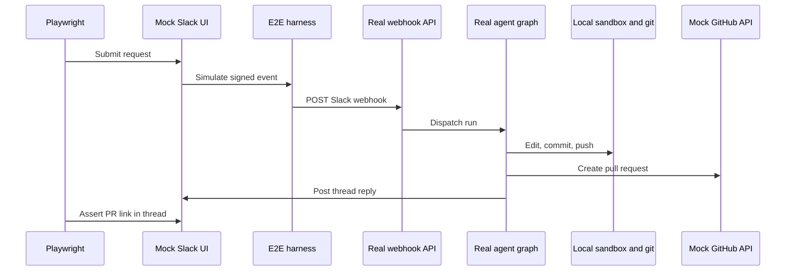

# Testing Infrastructure and Validation Patterns

The testing strategy separates concerns by layer: focused pytest tests for agent, middleware, reviewer, sandbox, and webhook behavior; dashboard Vitest for React rendering and client state; desktop Node tests for Electron main-process code; and Playwright for real webhook, authenticated dashboard, git/sandbox, and Electron integration. Choose the test layer that owns the contract being changed, running it in isolation with fakes and mocking only external boundaries.

<!-- openwiki: mermaid parse failed and this diagram was converted to a text fence so it does not break rendering. Fix the diagram source and restore the mermaid fence. Parser error: Heuristic: an unescaped angle bracket inside a label breaks rendering; rephrase the label. -->
```text
flowchart TD
    Change["Changed behavior"] --> Owner{"Boundary that owns it"}
    Owner -->|"Agent, middleware,<br/>reviewer, sandbox,<br/>webhook, tools"| Pytest["Focused pytest<br/>in asyncio auto mode"]
    Owner -->|"Dashboard React<br/>component or client"| Vitest["Dashboard Vitest"]
    Owner -->|"Electron main<br/>process"| Node["Desktop Node --test"]
    Owner -->|"Real webhook,<br/>authenticated UI,<br/>git, Electron"| Playwright["Focused Playwright"]
    Pytest --> Gate["Relevant quality gate"]
    Vitest --> Gate
    Node --> Gate
    Playwright --> Gate
```

## Python test organization and fixtures

### Pytest configuration and execution

Pytest collects tests from `tests/` (per `testpaths` in `pyproject.toml`). Tests run in asyncio auto mode (`asyncio_mode = "auto"`), so async test functions and fixtures are awaited automatically without per-test markers. Install development dependencies with `make install`, which runs `uv sync --extra dev`; the dev group includes pytest, pytest-asyncio, Ruff, ty, and Pygments.

```bash
make install
make test TEST_FILE=tests/sandbox/test_sandbox_state.py
uv run pytest -vvv tests/sandbox/test_sandbox_state.py::test_sandbox_proxy_retries_failed_startup
make lint
make typecheck
```

`make test` (alias `make tests`) executes `uv run pytest -vvv $(TEST_FILE)` when the path exists; otherwise it prints a skip message. Use `TEST_FILE` for a file or directory path; for a single node id like `file.py::test_name`, invoke pytest directly. Quality gates are independent: `make lint` runs Ruff checking and a format diff, `make format` fixes code in place, and `make typecheck` runs `ty check agent tests`.

### Shared fixtures and isolation

`tests/conftest.py` provides autouse fixtures that make unit tests independent of a live Store and built dashboard:

- **`fake_store`**: Routes `agent.store` access to an in-memory `FakeStore` that round-trips values through `model_dump`/`model_validate` the same way production does. Seed it only when persisted state is part of the contract.
- **`_no_bundled_dashboard`** (autouse): Points `DASHBOARD_STATIC_DIR` to a missing temporary directory so a locally built `ui/.output` cannot influence Python tests.
- **`_reset_ttl_cache`** (autouse): Clears the process-global TTL cache before and after each test, preventing cached team settings from leaking between tests.
- **`_reset_sandbox_registries`** (autouse): Clears `SANDBOX_BACKENDS` and `SANDBOX_CONNECTIONS` (process globals) to prevent one test's sandbox from answering for another's thread.
- **`_default_enable_auto_review`** (autouse): Stubs `is_review_repo_enabled` to return `True` for every repository because the dashboard opt-in list is empty without a live Store. Tests targeting the auto-review gate must override it with a stricter policy.
- **`registry_db`** and **`registry_db_if_available`**: Isolated PostgreSQL schemas for pull-request and repository rows; required for tests using the real database code path.
- **`slack_api`**: A mock Slack API server for tests driving real Slack endpoints without credentials.
- **`allowed_bot`**: Seeds a test Slack bot configuration into the fake store.

The `_workspace_store_import_completed` fixture treats the startup import of LangGraph Store workspaces as done, since tests do not run the application lifespan.

### System-boundary test locations and patterns

Use the narrow test family that carries the failure semantics being changed:

| Change | Focused location and protected behavior |
| --- | --- |
| Main agent construction, source-specific tools, backend, skills, or middleware | `tests/agent/test_agent_assembly_context.py`; it verifies the initialized `CompositeBackend`/`SandboxBackendProxy` arrangement, read-only skills, dynamic browser-tool exposure, and parent-only tool boundaries. |
| Reviewer findings, published reviews, reconciliation, check runs, or learning outcomes | `tests/reviewer/test_reviewer_outcomes.py`; maps resolution and feedback into true/false-positive outcomes and treats absent credentials or repository data as a no-op. |
| Lazy sandbox reconnection, capture offload, or sandbox identity recovery | `tests/sandbox/test_sandbox_state.py`; requires `BaseSandbox` compatibility, safe offload fallback, one shared reconnect, cancellation-safe waiting, retry after failed startup, and live-thread metadata fallback. |
| Completion notification and reviewer error cleanup | `tests/webhooks/test_completion_webhook.py`; errors on Slack-originated work send a thread reply and record the run, while reviewer failures settle a tracked check when its metadata and token exist. |
| Dashboard routes, thread API, session gate, or server rendering | `tests/dashboard/`; for example `test_dashboard_thread_api.py` verifies `/dashboard/api/*` behavior, and `test_dashboard_ui.py` asserts SSR and session requirements. |
| Middleware ordering, tool composition, error recovery, or state transitions | `tests/middleware/`; each middleware has focused contract tests (e.g., `test_model_fallback_middleware.py` for retry logic, `test_stable_tool_order.py` for ordering). |

Tests are organized by system owner. Use prompt snapshots only to protect rendered output, configuration precedence, tool composition, or behavioral results—not to restate static prompt text.

## Frontend tests: Vitest and Node

### Dashboard unit tests

For dashboard component rendering, client-side utilities, and state management, use Vitest:

```bash
pnpm --filter open-swe-dashboard run test
```

Vitest runs via `vitest run` from the dashboard workspace. Write tests for React rendering, optimistic state, stream transformation, terminal state transitions, and API-client behavior before escalating to browser E2E.

### Desktop unit tests

For Electron main-process code, use Node's built-in test harness:

```bash
pnpm --dir desktop run test
```

The desktop package builds its main bundle first, then runs `node --test test/*.test.cjs`. Tests verify IPC, window lifecycle, git operations, and local-agent invocation without launching a full browser.

### Root test delegation

`pnpm test` at the repository root delegates all workspace test tasks to Turbo, running dashboard Vitest and desktop Node tests in parallel. Use it after broad changes; otherwise target the workspace:

```bash
pnpm --filter open-swe-dashboard run test
pnpm --dir desktop run test
```

## End-to-end: Playwright with controlled boundaries

The E2E suite proves production integration without relying on live SaaS. It runs the real agent through `langgraph dev`, real webhook routes, tools, middleware, local sandbox provider, and real git against a seeded local bare remote. Only the LLM and external SaaS HTTP endpoints are faked; everything else is production code.



### E2E architecture and fakes

- **Real pieces**: Webhook routes, agent graph, deepagents loop, tools, middleware, real local sandbox provider, real git, real browser UI, real dashboard server rendering.
- **Faked boundaries**: LLM (scripted `BaseChatModel` in `fake_llm.py`), GitHub and Slack HTTP endpoints, token mint and installation lookups, LangSmith snapshot service.
- **Controlled state**: In-memory PR/Slack stores (`fakes.py`) that serve the mock UIs and enforce eligibility rules; seeded local bare remote that the agent clones and pushes.

The harness (`harness.py`) overlays the real `agent.webapp` with fake endpoints, mock UIs at `/mock/{slack,github}`, and control routes (`/control/reset`, `/control/login`, `/control/github-event`) that let the test driver compose requests and inspect state. It signs simulated Slack Events API deliveries before posting them to the real webhook route.

### Browser E2E: real dashboard and full flow

The browser suite drives the **actual built `ui/` React application**—not a mock—served same-origin from the harness so the session cookie and `/dashboard/api/*` calls work without CORS. Global setup (`global-setup.ts`) builds the real dashboard once (cached unless `E2E_FORCE_UI_BUILD=1`), starts its Nitro server on `E2E_UI_PORT` (default 3100), and the harness proxies page requests to it. This exercises real server rendering—the root session gate, the redirect, hydration—instead of a static shell.

`full_flow.spec.ts` proves the Slack request → implementation → PR → same-thread reply path. The browser directory also contains specs for dashboard/thread behavior, environment and plan approval, Slack redelivery/debouncing, SSR, output iframe, sandbox identity, and workspace scenarios.

```bash
pnpm install --frozen-lockfile
pnpm run test:e2e:install          # install Chromium dependencies
pnpm exec playwright test tests/full_flow.spec.ts  # single spec
pnpm run test:e2e                  # full browser suite
```

The browser configuration runs serially with one worker, ignores `desktop.spec.ts`, uses a 90-second test timeout, and reuses a warm `langgraph dev` server outside CI.

### Desktop E2E: Electron local-agent flow

The desktop spec (`tests/desktop.spec.ts`) separately resets harness state, clones the seeded local bare remote into an isolated temporary project, installs a harness-issued `osw_session` cookie, invokes the local-agent request, and verifies both the local project edit and fake-GitHub PR fields. It explicitly traces the Electron context, attaches screenshots for unified and completed views, and removes temporary state unless `E2E_KEEP_TMP` is set.

```bash
pnpm run test:e2e:desktop
```

The desktop configuration selects only `desktop.spec.ts`, raises timeouts to 180 seconds, uses a separate output directory, and disables automatic Playwright media recording because the spec explicitly records an Electron trace.

### Artifacts and replay

Recording costs real time on every spec, so browser tests keep a **trace** (DOM snapshots, network, console, source), **video**, and **screenshots on failure** only by default. Set `E2E_ARTIFACTS=1` to record everything under `test-results/` and `playwright-report/`, which is what you want when debugging a spec that passes but does the wrong thing.

In CI, the first retry retains trace and video for the failed attempt. Locally, they're kept only on failure (or explicitly via `E2E_ARTIFACTS=1`). Replay with `pnpm exec playwright show-trace test-results/<trace-file>.zip`.
