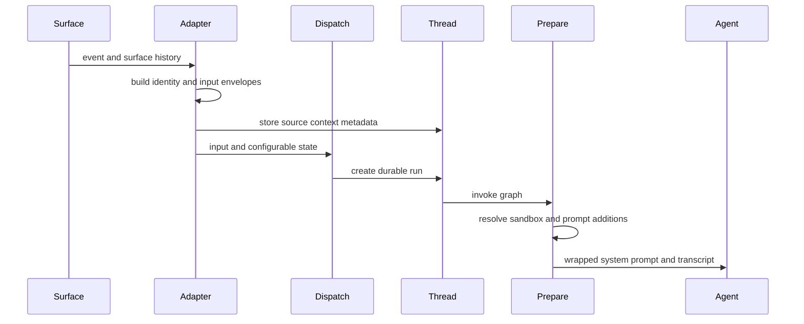

# Prompt and Context Assembly

Context is assembled in layers rather than by passing an event body verbatim to a model. Surface adapters construct a normalized `RunInput` transcript and run configuration; `create_durable_run` enforces the durable-run boundary and rejects ambiguous calls that combine a prebuilt input with raw content or identities. At execution time, prepare middleware resolves fresh, run-specific prompt material, checkpoints it by fingerprint, and supplies a wrapped system message to the agent.

This shows the separation between event normalization at dispatch and run-specific prompt preparation at execution. [Invocation](invocation.md) covers durable execution and [Follow-up messages](follow-up-messages.md) covers subsequent thread turns.

## Normalized input transcript

`agent/input_messages.py` is the serialization boundary for application-owned input. A human or system message is represented as an `<input-message>` envelope with a namespaced sender, surface, kind, optional channel, structured `<data>`, and escaped content. It supports multimodal block lists by enveloping text blocks while preserving non-text blocks. Entity introductions appear first as content-addressed `<dynamic-context>` messages for people, channels, and systems. Channel `topic` and `purpose` are explicitly marked as untrusted; they are context, not trusted instructions.

The generic dispatcher derives identities when an adapter has not supplied a complete input. For Slack, it uses the triggering-user and channel information in `RunConfig`; for GitHub or Linear, a GitHub login or Linear email supplies a person identity; otherwise the event is attributed to a synthetic system identity. Adapters can instead pass a deliberately ordered prebuilt transcript, which is necessary when history contains several participants or system/bot messages.

### Surface-specific history

- **Slack** builds a channel introduction, then serializes prior thread messages in order with each human, Open SWE, and third-party bot attributed separately. It adds an operational system-context message and appends the triggering request as a human message. The trigger-user fallback prevents edits and button interactions from being attributed to the bot or to nobody.
- **Linear** makes the issue description a system message with issue metadata, then appends relevant comments as human messages with per-author introductions and comment IDs. It uses comments from the triggering comment onward when available; otherwise it uses recent comments while filtering known bot responses. Images from the description and included comments remain multimodal blocks.
- **GitHub** creates attributed messages carrying issue/PR, comment type, path, line, and time metadata. A new issue thread fetches its comments to construct initial context, while an existing issue thread sends only the new follow-up/update. PR-comment runs similarly pass the comment sequence as structured input.

### Dynamic context across turns

An introduction includes a SHA-256 hash of its canonical XML representation. `visible_dynamic_context_hashes` identifies contexts still visible to the model and suppresses reintroduction of hashes already present. This accounts for deepagents summarization: when summarization replaces earlier messages with a summary, contexts at or after the cutoff remain visible, while those before it are gone from the prompt even though they persist in state. Only hashes in the visible range count as introduced, allowing a forgotten identity to be reintroduced when the model encounters a message from that sender again. Parsing helpers validate sender/entity identifiers and safely ignore malformed XML rather than treating it as authoritative context.

## Provenance is persistent metadata, not the transcript

`SourceContext` records the durable routing origin: a Slack thread, Linear issue, GitHub issue, and/or PR number. Webhook/adapters upsert it under `source_context` in LangGraph thread metadata; the first nonempty origin is preserved when later messages arrive, and the same record is carried by baby-sit watches. This is a pointer used for communication and lifecycle behavior, whereas the normalized `RunInput` carries what the model should see now.

The type is intentionally tolerant of distributed writers. All `SourceContext` models allow unknown extra fields via `extra="allow"` and `dump()` uses `exclude_unset=True`, preserving unrecognized data through a read-enrich-write cycle instead of inventing defaults. `parse()` accepts only mappings, returns an empty context with a warning on validation failure, and never raises—rather than failing a run on malformed historical metadata.

## Prompt preparation and instruction ordering

The graph factory creates a deep agent with an initially empty system prompt. `PrepareAgentRunMiddleware` performs setup before the agent: it obtains the sandbox/work directory, resolves the environment and sender information, schedules thread-title work, writes run metadata, and produces `rendered_system_prompt` plus separate sender-context messages. It deliberately does not splice sender metadata into a historical user message, because changing cached history would make later invocations send a different transcript.

`BasePrepareRunMiddleware` fingerprints the latest message and relevant configuration. Once its before-agent update is checkpointed, a resumed attempt with the same fingerprint skips preparation; a later invocation prepares fresh credentials, prompt, and context. Preparation must therefore be idempotent, and a sandbox failure is surfaced and re-raised rather than silently continuing without a workspace.

For every model call, the middleware combines the rendered prompt with any existing system message. The main prompt states that repository custom instructions and workspace instructions are mandatory, while `AGENTS.md` overrides them on conflict; sender-level standing instructions yield to repository instructions and `AGENTS.md`.

### Instruction precedence in the main agent

The complete instruction hierarchy in `construct_system_prompt`, from lowest to highest precedence, is:

1. **Default system guidance** — working environment, tools, task execution, dependencies, commit/PR, and self-awareness sections.
2. **Environment instructions** — workspace custom instructions configured by an admin.
3. **User instructions** — standing instructions for the triggering sender, stored per GitHub login. The prompt notes that these yield to repository and `AGENTS.md` instructions.
4. **Repository custom instructions** — configured by a workspace admin for this repository. The prompt treats them as mandatory rules and states they override defaults, but lose to `AGENTS.md` on conflict.
5. **`AGENTS.md` at the repository root** — mandatory rules that override all prior instruction sources.
6. **Scoped `AGENTS.md` files** — injected by `SubdirAgentsReadMiddleware` after successful `read_file` calls, with deeper scopes taking precedence.

## Repository conventions: `AGENTS.md`

The main-agent prompt requires that, after a repository is synchronized or cloned, the agent read the root `AGENTS.md` in full before other work. Its rules override defaults. `SubdirAgentsReadMiddleware` supplies a second, scoped mechanism: after a successful string-result `read_file`, it reads ancestor `AGENTS.md` files from the run sandbox and appends a `<system-reminder>`. Candidates are shallowest to deepest, and the reminder states that deeper scope wins. It tracks loaded paths per thread, treats a direct `AGENTS.md` read as loaded, limits reads to 1,000 lines and 64 KiB (with truncation), and lets a missing, unreadable, non-UTF-8, or otherwise unusable candidate fail without breaking the requested read.

The reviewer cannot assume a sandbox clone. It fetches the root convention document from GitHub Contents at the PR base SHA, preferring `AGENTS.md` and falling back to `CLAUDE.md` only after a 404. A non-200 response, network failure, or content over 64 KiB produces no root context rather than stale fallback rules. It also derives ancestor convention paths for changed files and fetches scoped files concurrently under a semaphore; each candidate independently skips failures and the ordered results make nested instructions override parent instructions.

## Skills: lazily readable prompt extensions

Skills are instructions exposed as virtual `SKILL.md` files rather than copied wholesale into the prompt. A `CompositeBackend` keeps the run backend as default and routes skill prefixes to specialized backends; it strips the route prefix before delegation. Passing those prefixes in `create_deep_agent(skills=[...])` lets deepagents advertise skills while the agent reads full instructions through ordinary `read_file`.

The main graph always mounts repository-bundled `baby-sit` and `html-artifacts` skills read-only at `/bundled-skills/`. Hosted runs additionally mount organization skills read-only at `/organization-skills/` and, when a profile login exists, per-user skills read-only at `/skills/`; the user route is first, so it has priority. Skills are persisted as `/<name>/SKILL.md` under the appropriate store namespace with YAML name/description front matter and a replacement instruction body. Names, sizes, and organization count are bounded; user tools resolve the current GitHub login, while organization-skill tools require an admin. Desktop runs instead source user skills from run state, omit organization skills, and route artifacts away from the project checkout.

The style analyzer uses an independent `/skills/` `StateBackend` route. Launchers seed its run input `files` with the prefix-stripped bundled playbooks, and `skill_path_for_mode` chooses `bootstrap-repo-analysis` or `continual-learning`. Its prepare middleware renders a focused analyzer prompt that requires reading that mode's playbook; it does not write a skill into the analyzer sandbox.

## Safe change and focused verification

Changes to this workflow should preserve the boundary between untrusted event content, structured identity metadata, durable provenance, and system instructions. In particular, do not turn channel fields into trusted prompt text, mutate cached historical messages to add current sender data, or suppress a dynamic context merely because it exists before the summarization cutoff.

Focused tests live in `tests/agent/test_input_messages.py`, `tests/agent/test_source_context.py`, `tests/agent/test_dispatch.py`, `tests/agent/test_agents_md.py`, `tests/middleware/test_subdir_agents_middleware.py`, `tests/slack/test_slack_context.py`, and `tests/agent/test_skills.py`. They are the first checks for envelope/hashing behavior, malformed provenance, dispatch contracts, convention-document failure modes, scoped injection, Slack attribution, and virtual-skill routing.
