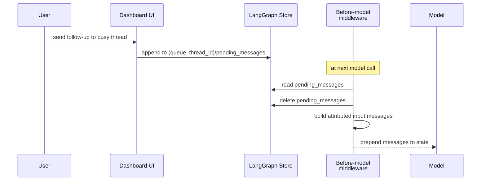

# Follow-up Messages and Polling

This workflow explains how Open SWE manages deferred work after a thread's active run completes, including message queuing for in-flight handoffs, background monitoring (baby-sit watches and sandbox background tasks), and the scheduler's role in dispatching follow-ups.

Two key mechanisms handle work that arrives while a thread is busy or while monitoring external conditions:

- **Store-backed message queue** (`check_message_queue_before_model`): Dashboard follow-ups are queued in the store before a model call, allowing handoffs without creating separate runs.
- **Scheduled follow-up runs**: Background monitoring systems (baby-sit, background tasks) and the scheduler dispatch new runs at specific intervals or after terminal conditions, using `multitask_strategy="enqueue"` to preserve run ordering.

## Message queue and before-model injection

### Queueing messages for a live run

The dashboard's `send_dashboard_message` endpoint does not create a new run immediately. Instead, it queues a message for injection into the active run at its next model boundary. It first authorizes the caller against thread metadata, checks that the thread is `busy` (returning 409 for idle threads and 502 if status cannot be determined), then stores the message in the LangGraph store:



`queue_message_for_thread` persists each message as a `{"content": ...}` entry at the store namespace `("queue", thread_id)` with key `pending_messages`. Messages are appended in FIFO order and the queue caps at 100 newest entries, dropping the oldest on overflow. Store errors are logged and reported to the dashboard as a failed queue operation.

### Before-model middleware drain and attribution

`check_message_queue_before_model` is installed in both the agent and reviewer graphs as a before-model middleware. It is deliberately excluded from the agent's `stop_summary` mode (read-only summary runs have no need to consume queued messages).

At every model boundary, the middleware performs three sequential operations:

1. **Consume a batched autofix event** from `("autofix", thread_id) / "pending_event"` (if present). It deletes the event and prepends a system instruction to re-check CI and review comments before finishing, rather than launching a separate run. This allows baby-sit status changes to be handled within the active run.

2. **Read and clear the message queue** from `("queue", thread_id) / "pending_messages"`. The middleware deletes the entire record *before* conversion, preventing a subsequent invocation during the asynchronous conversion (e.g., image fetches) from injecting the same batch twice. A snapshot of the queued messages is taken first, so any follow-ups appended while the conversion is in flight are preserved.

3. **Convert queued messages to input blocks** and append them to the model's state. Each message is reconstructed through `build_input_messages`:
   - Ordinary queued blocks become a system message attributed to `system:thread-queue` on the automation surface.
   - A dashboard payload (identified by `source: "dashboard"`) produces a dashboard-handoff system message followed by a human message attributed to its supplied sender on the web surface.
   - Dynamic identity context is emitted only when its hash is not already visible to the model. The visibility calculation honors summarization cutoffs, so context retained only in historical state is re-introduced.
   - Each structured envelope is its own message because the transcript parser expects one `<input-message>` envelope per message. Plain text blocks may be merged before serialization.

### Image handling and error resilience

For payloads with image URLs, the middleware resolves the thread's configured model once. If the model does not support vision, it omits those fetched images and adds a warning to the text; supplied image blocks are retained. Failures reading images or the queue are logged and allow the model call to proceed rather than aborting the run. A failed queue read still flushes any autofix instruction already assembled, ensuring partial content is not lost.

## Background monitoring and follow-up dispatch

### Baby-sit CI monitoring

`/baby-sit` is an opt-in watch for pull-request CI status. It runs on a configurable cron schedule (10-minute intervals by default) and evaluates whether CI has succeeded, failed, or remains pending. When CI status changes from a previous evaluation, it dispatches a follow-up run with `multitask_strategy="enqueue"` to let the interactive agent finish before the notification begins:

<!-- openwiki: mermaid parse failed and this diagram was converted to a text fence so it does not break rendering. Fix the diagram source and restore the mermaid fence. Parser error: Heuristic: an unescaped angle bracket inside a label breaks rendering; rephrase the label. -->
```text
flowchart TD
    Cron["10-minute cron tick"]
    Evaluate["evaluate_watch"]
    Fetch["Fetch current PR CI status"]
    Compare["Compare to previous evaluation"]
    Changed{Status changed?}
    Notify["Post notification to Slack or GitHub"]
    Dispatch["dispatch_agent_run with<br/>multitask_strategy=enqueue"]
    Stop["stop_watch"]

    Cron --> Evaluate
    Evaluate --> Fetch
    Fetch --> Compare
    Compare --> Changed
    Changed -->|no| Evaluate
    Changed -->|yes| Notify
    Notify --> Dispatch
    Dispatch --> Stop
```

The watch stores metadata including retry count, dispatch keys for idempotence, and delivery tracking. Terminal failures (exceeding retry limits) and successful CI (all checks passing) stop the watch and post a summary to the originating thread.

### Background task completion monitoring

`monitor_background_tasks` polls sandbox background commands on a per-minute cron schedule. It tracks running and terminal tasks, and when a task reaches a terminal state (completed, failed, timed out, stopped, or lost), it:

1. Claims the notification with a filesystem marker to prevent duplicate delivery.
2. Builds a notification message from the task's completion status.
3. Dispatches a follow-up run with `multitask_strategy="enqueue"` and context marking it as a background-task completion.
4. Marks the notification as delivered and cleans up the claim.

When all running and pending background tasks are complete, the monitor deletes its per-thread cron entry and clears the running-tasks metadata, shutting down the background-task monitoring for that thread.

### Scheduler-driven follow-ups

`/agent/scheduler.py` is the model-free automation layer that routes cron ticks and delayed runs. Its principal consumers are:

- **Dashboard recurring runs**: Execute user-defined agent automations on a cron schedule.
- **Stale-run reconciliation** (`reconcile_stale_runs`): Recovers threads blocked by runs older than a configurable age (default 1,800 seconds) by interrupting them.
- **Session cost refresh** (`session_cost`): A delayed-run chain that enriches Slack message footers with actual run costs, once LangSmith data is available.
- **Agent cost recording** (`agent_cost`): Writes a single run's usage cost to the dashboard.
- **Baby-sit watches** and **background-task monitors**: Route to their dedicated evaluation and monitoring handlers.

## Polling: completion webhook and run state

Every durable dispatch attaches a completion webhook only when both `RUN_COMPLETE_WEBHOOK_SECRET` is set and `COMPLETION_WEBHOOK_URL` is absolute and non-loopback. The webhook route rejects requests whose token fails verification and is fail-closed when no secret is configured.

The completion webhook handler processes terminal runs:

- **Success**: Schedules session-cost refresh (for Slack runs only), schedules a private feedback prompt five minutes later, and returns the code-channel session to `active`.
- **Error or timeout**: Posts a best-effort failure reply with run-scoped idempotence (per run ID or thread-level fallback).
- **Interrupted**: Intentionally ignored—with `multitask_strategy="interrupt"`, an interruption is expected and healthy, not a failure.

Run-completion replies are best-effort and never block run creation. A missing webhook or a completion that arrives out of order has no side effects beyond deferred feedback and cost enrichment.

## Stop and follow-up cleanup

### Slack emergency stop (`:x:` reaction)

The `:x:` reaction on a Slack message triggers immediate stop processing:

1. Resolve the reaction's target thread through Slack-run mapping or root timestamp.
2. Verify the thread metadata matches the Slack channel and thread timestamp (mismatch is rejected).
3. Claim the event ID for delivery deduplication.
4. Enumerate and cancel every pending and running run for the thread.
5. Clear deferred-work records: delete `("queue", thread_id) / "pending_messages"` and `("autofix", thread_id) / "pending_event"`.
6. Update thread metadata with `latest_run_status="interrupted"` and `stop_requested_at_ms`.
7. Dispatch a read-only stop-summary run that permits only thread inspection and summary output.

The summary run is mapped back to the Slack thread via the Slack-run mapping, so a subsequent `:x:` reaction can find and stop it. If cancellation or cleanup fails, the handler does not claim success, so the webhook will retry.

A code-channel `agent_session_stopped` event performs the same cancellation and cleanup without dispatching a summary run, and returns the session to `active` status.

### Dashboard stop and queued-message preservation

The dashboard stop endpoint authorizes the caller, cancels all pending and running runs, and marks the thread interrupted. Unlike Slack stop, it **preserves** `pending_messages` in the store. If a queued follow-up exists, it dispatches an empty-input agent run after cancellation; the before-model middleware drains the preserved queue, allowing the follow-up to continue the conversation without losing user input.

The admin variant cancels and marks interrupted without authorization checks or queued continuation.

## Durable dispatch and multitask strategy

`dispatch_agent_run` is the common agent/reviewer dispatch contract. It uses `multitask_strategy="interrupt"` by default, superseding active work and resuming with full history plus the new message. Low-priority work (baby-sit updates, background-task notifications) opts into `multitask_strategy="enqueue"`, waiting at the platform run queue:

- **Explicit Slack requests** (tagged mentions): use `"interrupt"` to prioritize the user's urgent input.
- **Untagged Slack follow-ups**: use `"enqueue"` to allow the current turn to finish before the follow-up begins.
- **Slack message edits**: placed in the store message queue instead of creating a run, so an edit corrects the existing conversation without creating new runs.
- **Baby-sit and background-task notifications**: use `"enqueue"` to preserve the interactive run's ordering.

Durable dispatch uses `durability="sync"` (checkpoint before each step), resumable/subgraph-capable Protocol v2 stream modes, and an optional completion webhook. This preserves a checkpoint before each step and allows a later dashboard client to replay runs it did not create.

The sandbox lifecycle relies on interrupt dispatch: a subsequent agent step resolves the sandbox by thread, reusing an in-memory backend or reconnecting through the persisted `sandbox_id`. An unreachable existing sandbox is not silently replaced for a normal agent thread, because replacement would discard uncommitted work; a deleted sandbox can be recreated, and the read-only reviewer can explicitly allow replacement.

## Testing and regression coverage

Focused regression tests exercise message queue draining, dashboard handoff attribution, error resilience when queue reads fail, Slack stop cleanup (mapped and root reactions), cancellation of pending and running runs, deferred-work deletion, summary dispatch, duplicate and missing-event protection, and the no-summary code-channel session-stop path.
