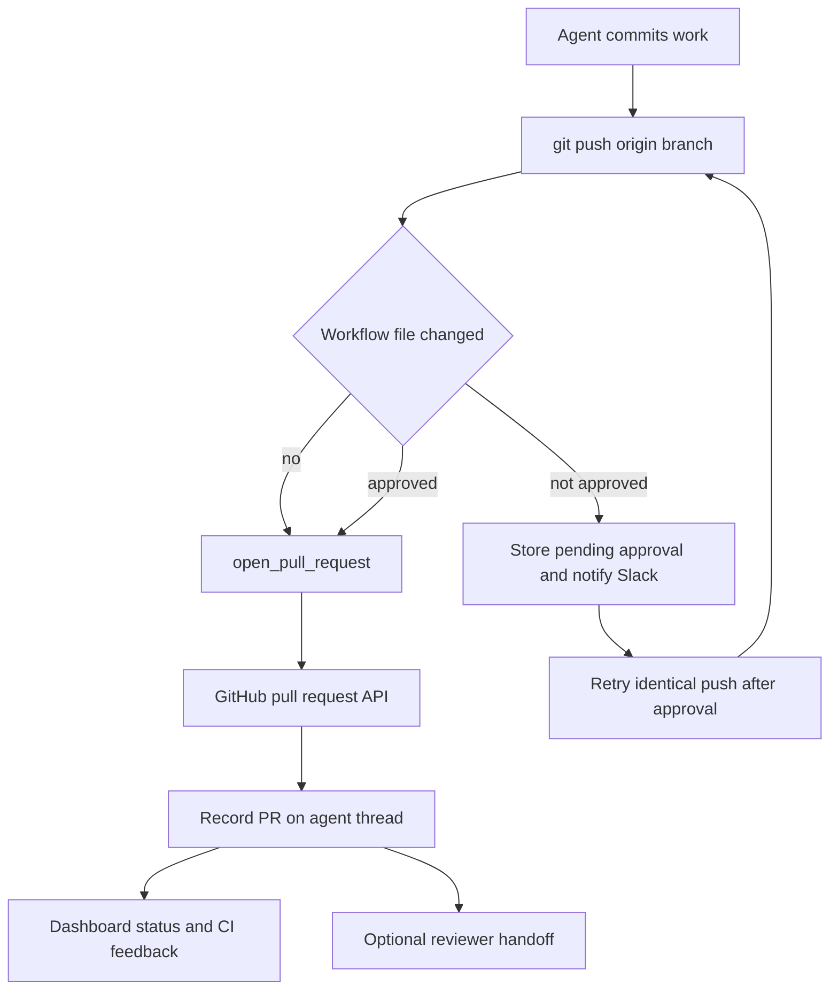

# Pull Request Opening and Iteration

The delivery path is **commit → push → open or update PR → CI and review feedback**. New PR creation is deliberately centralized in `open_pull_request` to preserve the triggering user's GitHub attribution. Middleware protects two risk boundaries: substitutes for attributed creation and pushes that change GitHub Actions workflows. Thread PR records then connect delivery to Slack, dashboard status, lifecycle updates, and follow-up automation.

Caption: the normal code-delivery flow, with workflow approval applied before the branch can be pushed.

## Create and update a PR through the attributed tool

For a new PR, push the branch to `origin` first and call `open_pull_request(owner, repo, head, base, title, body, draft=True, resolves_thread=False)`—not `gh pr create`. The success result includes the URL, number, author, token kind, and `created` flag that distinguishes a newly opened PR from an already-existing one. Use `gh pr edit` for an existing PR, readiness, comments, and status updates.

The tool is idempotent per head branch: when GitHub returns an HTTP 422 (unprocessable entity) during creation, the tool looks up the existing open PR for the head branch and returns it with `created=False`, avoiding a duplicate. This allows the agent to switch to `gh pr edit` for subsequent updates rather than failing.

For Slack, Linear, and dashboard runs, `_resolve_pr_author_token` looks up a current OAuth token by the triggering user's configured GitHub login, rather than using shared thread metadata. Thus the requester authors the PR. GitHub-triggered runs, unmapped or unauthorized users, and bot-only deployments fall back to the GitHub App installation token, so `open-swe[bot]` becomes the creator.

### Preflight validation

Before posting, the tool runs a preflight that GETs the repository, base branch, and same-owner head branch. It distinguishes:
- **`github_app_access_missing_or_repo_not_found`**: Repository does not exist or the GitHub App lacks access (HTTP 403/404 on repo lookup).
- **`github_pr_branch_not_visible`**: A branch GitHub cannot see, returned as HTTP 404 on branch lookup.
- **`github_pr_preflight_failed`**: Other preflight problems (HTTP 5xx or malformed responses).

The error reports GitHub's status code, selected diagnostic headers (rate-limit, authentication challenge, accepted permissions), and a truncated response body instead of hiding the cause. No available token is a separately reported `no_github_token` failure.

### Draft state, references, and thread resolution

The `draft` parameter is a request. A boolean `draft_prs` value in runtime configuration overrides it for a new PR; the profile default is `True`. An already-existing PR is returned unchanged; the draft status cannot be altered by the open_pull_request tool.

Unless the body already contains `## References`, the tool appends a dashboard plan link and source-reference links. Slack, Linear, and GitHub issue source links are included only when GitHub positively confirms that the destination repository is private. Lookup failures or uncertain visibility fail closed, preventing private conversation links from being added to a public PR.

Set `resolves_thread=True` on a PR intended to finish the work. PR lifecycle webhooks locate agent threads by persisted PR URL and auto-resolve only when every tracked PR is closed or merged and at least one tracked PR has that flag. If all tracked PRs are closed but none has it, the thread is marked `attention_reason="prs_closed"` for a person to decide; reopening clears that mark.

## Recording delivery and metadata

After either creation or duplicate discovery, `_record_pr_telemetry` fetches full PR details, records PR usage for analytics, and upserts a normalized record into the thread's `pull_requests` metadata (while maintaining legacy fields and `pr_urls`). The normalized state is `draft`, `open`, `closed`, or `merged`. Key fields recorded are:
- `repo_full_name`, `number`, `url`, `title`, `state`
- `head_ref`, `base_ref`, `author`, `author_avatar_url`, `created_at`
- `diff_stats`: `{files, additions, deletions}`
- `resolves_thread`: Boolean flag for lifecycle completion

For an active Slack code-channel session, the tool also updates the repository context bar, registers the PR as an agent resource, and sets the diff view only if GitHub returns a nonempty diff. This entire telemetry sequence is best effort: exceptions are logged and do not turn a successful creation result into a failure. Because it is one protected sequence, an earlier telemetry exception can skip later bookkeeping; it is not transactional.

## Mutation guards

### Stop unattributed creation fallbacks

`PullRequestCreationGuardMiddleware` wraps `execute` and `background_execute` tool calls. It blocks shell attempts to open a PR outside `open_pull_request`:
- `gh pr create`
- `gh api` with POST/body submission to a `/repos/.../pulls` endpoint
- `curl` with POST/body submission to `https://api.github.com/repos/.../pulls`

The middleware tokenizes commands and recursively expands supported `bash`, `dash`, `sh`, and `zsh` `-c` commands to catch nested forms. Expansion is bounded (maximum 3 levels deep) and fail-closed at the depth limit.

The block is the non-recoverable `PullRequestCreationFallbackBlocked` error with code `pr_creation_fallback_blocked`, preserving the original attributed-tool failure rather than concealing it through an unattributed substitute. The main hosted agent installs this guard only outside local runs; the workflow push guard is installed for both main agents and subagents.

### Require approval for workflow pushes

`WorkflowPushGuardMiddleware` gates eligible standalone `git push origin <refspec>` shapes (also supported with `git -C`, `cd ... &&`, and `--set-upstream`). Commands with unsafe shell syntax or other push forms are left to normal execution. For an eligible current-branch push, it computes the range against the remote branch or merge base and checks changed paths under `.github/workflows/`; a push without such changes proceeds untouched.

For workflow changes, it captures:
- The binary diff and a bounded text preview
- File paths, addition/deletion statistics, base and head SHA
- A SHA-256 fingerprint of the change identity

The per-thread `workflow_push_approvals` store is keyed by that fingerprint. Pending entries retain the review data and notification state; approved and rejected entries are terminal, and storage keeps the 20 most recent records.

An **approved fingerprint** permits the push only after the middleware rewrites it to an explicit `<head_sha>:refs/heads/<branch>` refspec, making the exact commit SHA explicit and preventing any possible history rewrite. Otherwise it returns `WorkflowPushApprovalRequired`, ensures a pending record, and sends a Slack interactive approval request only if that record has not already been notified. Notification is marked only after Slack returns a message timestamp without error. Any workflow change changes the fingerprint and therefore needs a new decision.

The web approval API (`/dashboard/api/workflow-approval/{thread_id}/{fingerprint}/approve`) requires a session, same-origin mutation protection, and readability of the thread. Approving records the session subject as the actor and dispatches a follow-up instructing the agent to retry the unchanged push; rejecting records the decision and leaves the push blocked.

## CI, feedback, and review

CI readers paginate GitHub check runs and legacy commit statuses, returning `None` on permission or HTTP failures so webhook handling remains best effort. The auto-fix path treats only completed `failure`, `timed_out`, and `action_required` check runs as fixable and excludes Open SWE's own checks. It removes failure names already present on the base SHA, and auto-fix without an explicit mention fails closed unless the requester has `write`, `maintain`, or `admin` repository permission.

Webhook helpers normalize branch, head SHA, and failure state across `check_run`, `check_suite`, `workflow_run`, and legacy `status` payloads. The baby-sit handler continues only for a completed failure that matches an active watch by SHA or branch. See [Scheduling and Baby-sit](scheduling-and-baby-sit.md).

For GitHub feedback, `fetch_pr_comments_since_last_tag` merges issue comments, inline comments, and nonempty reviews chronologically. On a first Open SWE mention it returns the whole conversation so earlier drafted inline comments are available; on repeated mentions it returns items after the preceding mention. Mention matching uses configured deployment handles and rejects prefix-only matches. Raw comment bodies are sanitized and untrusted authors are wrapped before prompt use.

## Dashboard status contract

The dashboard reads each tracked PR record independently. It fetches the live PR, unresolved GraphQL review threads, and check runs plus legacy statuses for the live head SHA. Its result covers open/closed/merged state, draft state, merge-conflict state, linked failing checks, pending and inconclusive counts, and unresolved review-thread details.

This API degrades to partial availability rather than failing the whole view. `statusAvailable`, `checksAvailable`, and `commentsAvailable` identify usable portions; invalid metadata, missing permissions, malformed responses, and transient GitHub errors produce unavailable fields rather than falsely reporting a clean PR. Consumers must honor the flags.

## Focused verification

`tests/github/test_open_pull_request.py` covers author token choice, preflight diagnostics, duplicate handling, references, and metadata upsert. `tests/github/test_pr_creation_guard.py` exercises direct and nested shell fallback detection. Workflow push guard tests exercise safe parsing, workflow diff and fingerprint construction, pending notification, and approved-ref rewriting. `tests/github/test_github_ci.py`, `tests/github/test_baby_sit_webhook.py`, and feedback tests cover CI classification, dispatch, and GitHub feedback behavior.
