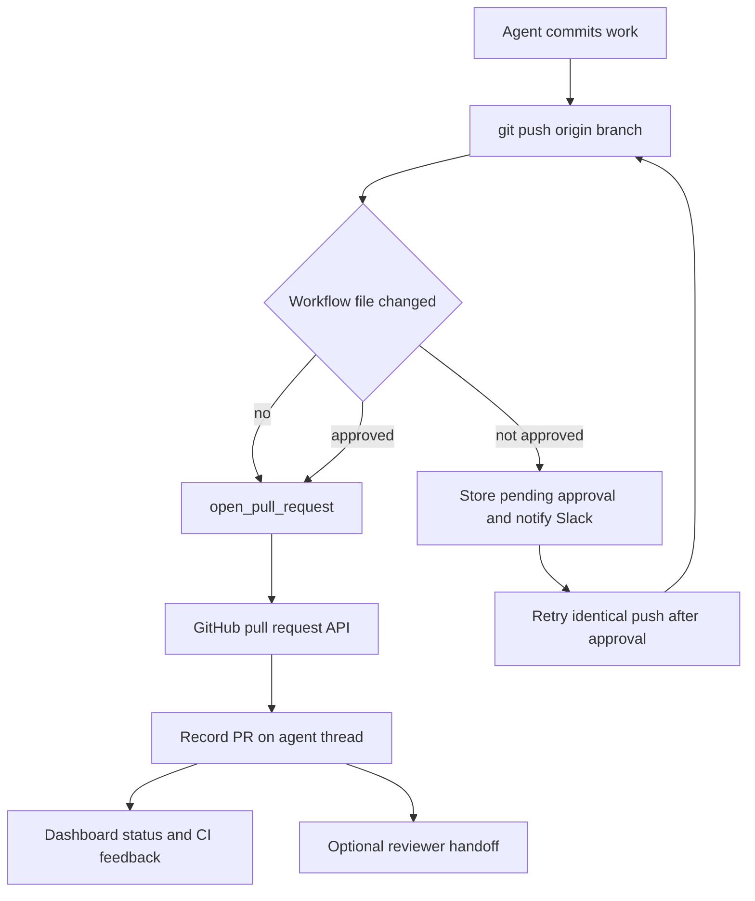

# Pull Request Creation and Opening

The delivery path is **commit → push → open or update PR → CI and review feedback**. Pull request creation is deliberately centralized in `open_pull_request` to preserve the triggering user's GitHub attribution and return idempotent, actionable results. Before pushing, workflow-file changes require human approval to prevent unvetted CI/CD modifications. After creation, the tool records PR metadata, usage, and Slack context.

```mermaid
flowchart TD
    Commit["Agent commits work"] --> Push["git push origin branch"]
    Push --> Workflow{"Workflow file changed"}
    Workflow -->|"no"| Open["open_pull_request"]
    Workflow -->|"approved"| Open
    Workflow -->|"not approved"| Pending["Store pending approval and notify Slack"]
    Pending --> Retry["Retry identical push after approval"]
    Retry --> Push
    Open --> GitHub["GitHub pull request API"]
    GitHub --> Thread["Record PR on agent thread"]
    Thread --> Status["Dashboard status and CI feedback"]
    Thread --> Review["Optional reviewer handoff"]
```
Caption: the normal code-delivery flow, with workflow approval applied before the branch can be pushed.

## Open a PR through the centralized tool

For a new PR, push the branch to `origin` first and call `open_pull_request(owner, repo, head, base, title, body, draft=True, resolves_thread=False)`—not `gh pr create` or direct API calls. The success result includes the URL, number, author, token kind, and `created`. Use `gh pr edit` for updating an existing PR's metadata, labels, or status.

A 422 creation response triggers a lookup for an already-open PR on the head branch. If found, the tool returns it with `created=False` instead of failing, allowing the agent to switch to `gh pr edit` for updates rather than erroring out. This idempotency is keyed by head branch: only one open PR per head branch is returned.

For Slack, Linear, and dashboard runs, `_resolve_pr_author_token` looks up a current OAuth token by the triggering user's configured GitHub login, rather than using shared thread metadata or the bot's token. Thus the requester authors the PR as themselves. GitHub-triggered runs, unmapped or unauthorized users, and bot-only deployments fall back to the GitHub App installation token, so `open-swe[bot]` becomes the author.

Before posting, the tool runs a preflight that GETs the target repository, base branch, and a same-owner head branch. It distinguishes absent repository or App access (`github_app_access_missing_or_repo_not_found`), a branch GitHub cannot see (`github_pr_branch_not_visible`), and other preflight problems (`github_pr_preflight_failed`). The error response includes GitHub's HTTP status, selected diagnostic headers (rate-limit, request ID, auth scopes), and a truncated response body instead of hiding the cause.

### Draft status, references, and thread resolution

The `draft` parameter is a request default. A boolean `draft_prs` value in runtime configuration overrides it; the profile default is `True`. An already-existing PR is returned unchanged without re-applying draft status.

Unless the body already has a `## References` section, the tool appends a dashboard plan link and source references. Slack, Linear, and GitHub issue source links are included only when GitHub positively confirms that the destination repository is private. Lookup failures or uncertain visibility fail closed, preventing private conversation links from leaking into a public PR.

Set `resolves_thread=True` on a PR intended to finish the work. PR lifecycle webhooks locate agent threads by persisted PR URL and auto-resolve only when every tracked PR is closed or merged and at least one tracked PR has that flag set. If all tracked PRs are closed but none has it, the thread is marked `attention_reason="prs_closed"` for human review; reopening clears that mark.

## Recording delivery

After either creation or duplicate discovery, `_record_pr_telemetry` best-effort fetches full PR details, records agent PR usage metrics, and upserts a normalized PR record into the thread's `pull_requests` metadata (while maintaining legacy `pr_urls`, `pr_url`, and related fields). The normalized state is `draft`, `open`, `closed`, or `merged`.

For an active Slack code-channel session, it also updates the repository context bar, registers the PR as an agent resource, and sets the diff view only if GitHub returns a nonempty diff. This entire telemetry sequence is best effort: exceptions are logged and do not turn a successful creation result into a failure. Because it is one protected sequence, an earlier exception can skip later bookkeeping; it is not transactional.

## Mutation guards

### Stop unattributed creation fallbacks

`PullRequestCreationGuardMiddleware` wraps `execute` and `background_execute` tool calls and blocks shell attempts to open a PR outside `open_pull_request`: `gh pr create`, `gh api` POST/body submissions to a `/pulls` endpoint, and `curl` POST/body submissions to GitHub's pulls endpoint. It tokenizes commands and recursively expands supported `bash`, `dash`, `sh`, and `zsh` `-c` commands to arbitrary depth, fail-closed at a bounded expansion limit.

The block returns the non-recoverable `PullRequestCreationFallbackBlocked` error with code `pr_creation_fallback_blocked`, preserving the original attributed-tool failure rather than concealing it through an unattributed substitute. The main hosted agent installs this guard only outside local desktop runs; subagents never skip it. Subagent guard middleware also includes the PR-creation guard for the same reason.

### Require approval for workflow pushes

`WorkflowPushGuardMiddleware` only interprets conservative, standalone `git push origin <refspec>` shapes (also supported with `git -C`, `cd ... &&`, and `--set-upstream`). Commands with unsafe shell syntax, piping, or other push forms bypass the guard and execute normally. For an eligible current-branch push, it computes the range against the remote branch or merge base and checks changed paths under `.github/workflows/`.

For workflow changes, it captures the binary diff, bounded preview, file/addition/deletion statistics, base and head SHA, normalized remote, and a SHA-256 fingerprint of the change identity. The per-thread `workflow_push_approvals` store is keyed by that fingerprint. Pending entries retain the review data and notification state; approved and rejected entries are terminal. Storage keeps the 20 most recent records per thread.

An approved fingerprint permits the push only after the middleware rewrites it to an explicit `<head_sha>:refs/heads/<branch>` refspec. Otherwise it returns `WorkflowPushApprovalRequired`, ensures a pending record, and sends a Slack interactive approval request only if that record has not already been notified. Notification is marked as sent only after Slack returns a message timestamp without error. Any workflow change changes the fingerprint and therefore requires a new decision.

The web approval API requires a session, same-origin mutation protection, and readability of the thread. Approving records the session subject as the actor and dispatches a follow-up instructing the agent to retry the unchanged push; rejecting records the decision only and leaves the push blocked.

## Handoff to review

`request_pr_review` is a handoff to the reviewer agent, not a creation operation. It validates a GitHub PR URL, resolves the active Slack thread and triggering identity from run configuration, then delegates to `trigger_pr_review_from_ref`. Invoke it only for an explicit request to start the reviewer. This is distinct from PR creation and is covered in the [PR Review](pr-review.md) workflow.

## Focused verification

`tests/github/test_open_pull_request.py` covers author token choice, preflight diagnostics, duplicate handling, references, and metadata upsert. `tests/github/test_pr_creation_guard.py` exercises direct and nested shell fallback detection. Workflow push guard tests exercise safe parsing, workflow diff and fingerprint construction, pending notification, and approved-ref rewriting. Guard middleware tests verify installation for main agents vs. subagents vs. local runs.
