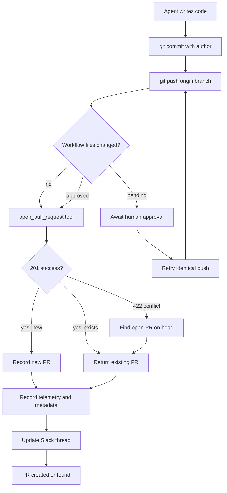

# Pull Request Creation

The pull request creation workflow ensures that code is delivered through GitHub with the triggering user's attribution, workflow-file changes are approved before pushing, and all PR metadata connects back to the originating Slack thread, Linear ticket, or dashboard plan. The core flow is **commit → push (with workflow approval) → open_pull_request → record metadata**.


```mermaid
flowchart TD
    Write["Agent writes code"] --> Commit["git commit with author"]
    Commit --> Push["git push origin branch"]
    Push --> WorkflowCheck{"Workflow files changed?"}
    WorkflowCheck -->|no| OpenPR["open_pull_request tool"]
    WorkflowCheck -->|approved| OpenPR
    WorkflowCheck -->|pending| WaitApproval["Await human approval"]
    WaitApproval --> Retry["Retry identical push"]
    Retry --> Push
    OpenPR --> CheckStatus{201 success?}
    CheckStatus -->|yes, new| RecordNew["Record new PR"]
    CheckStatus -->|yes, exists| RecordExist["Return existing PR"]
    CheckStatus -->|422 conflict| FindExist["Find open PR on head"]
    FindExist --> RecordExist
    RecordNew --> Telemetry["Record telemetry and metadata"]
    RecordExist --> Telemetry
    Telemetry --> Thread["Update Slack thread"]
    Thread --> Done["PR created or found"]
```

## Commit and authorization

The agent commits work using the sandbox's Git configuration, typically with an author identity derived from run context. The commit message is crafted by the agent during code planning; squash-message synthesis (described below) applies when merging a multi-commit PR through the dashboard or a review tool.

Pull request creation is deliberately centralized in `open_pull_request` to preserve the triggering user's GitHub attribution. The tool accepts `owner`, `repo`, `head`, `base`, `title`, `body`, `draft=True`, `resolves_thread=False`, and `retitle_thread=True`.

**Do not use `gh pr create`** or other shell fallbacks. `PullRequestCreationGuardMiddleware` blocks them with a non-recoverable error, ensuring that if `open_pull_request` fails, that real failure is surfaced rather than hidden behind an unattributed fallback.

### Author token resolution and GitHub attribution

`_resolve_pr_author_token` chooses which GitHub token will be used to author the PR. The triggering user's OAuth token is preferred when available:

- **Slack/Linear/dashboard sources:** Look up the user's current OAuth token by their configured GitHub login.
- **GitHub-triggered runs:** Use the GitHub App installation token (`open-swe[bot]`).
- **Unmapped users or bot-only deployments:** Fall back to the app token.
- **No token available:** Return a `no_github_token` failure instead of proceeding.

If a user's token has been revoked, the preflight returns `github_user_auth_revoked` with a link to re-authenticate.

## Workflow approval gates pushing

Before a branch can be pushed, `WorkflowPushGuardMiddleware` inspects standalone `git push origin <refspec>` commands (including `git -C`, `cd ... &&`, and `--set-upstream` variants). If the push touches `.github/workflows/` files:

1. **Compute a diff fingerprint:** The middleware inspects the repository, computes the changed-path range (against the remote branch or merge base), captures the binary diff, generates a preview, and records file/addition/deletion statistics. A SHA-256 fingerprint of this payload becomes the approval key.

2. **Check approval state:** Look up the fingerprint in the thread's `workflow_push_approvals` metadata. An approved fingerprint allows the push only after rewriting it to an explicit `<head_sha>:refs/heads/<branch>` refspec for safety.

3. **Request approval if needed:** If the fingerprint is not approved, create a pending record, post a Slack interactive message (only if the record hasn't been notified), and block the push with `WorkflowPushApprovalRequired`. The thread owner can approve or reject via Slack or the web UI.

4. **Track history:** The per-thread `workflow_push_approvals` store keeps the 20 most recent records. Approved and rejected entries are terminal; any workflow-file change generates a new fingerprint and requires fresh approval.

Pushes without workflow-file changes proceed untouched. Commands with unsafe syntax (shell operators, pipes, or backticks) are left to normal execution, not inspected.

## Preflight access checks

Before attempting to create a PR, `_preflight_pr_access` validates that the token has access to the target repository and both the base and head branches:

1. **GET the repository** to confirm the token can read it.
2. **GET the base branch** to confirm it exists and is readable.
3. **GET the head branch** (same-owner only) to confirm the push succeeded.

Each check distinguishes specific failure codes:

- `github_app_access_missing_or_repo_not_found` (403/404 on repo GET)
- `github_pr_branch_not_visible` (404 on branch GET)
- `github_pr_preflight_failed` (other non-success on repo/branch checks)
- `github_user_auth_revoked` (401 on repo GET with a user token)

Failure payloads report GitHub's actual HTTP status, selected diagnostic headers (rate-limit, auth headers), and a truncated response body so the agent can diagnose the issue directly without opaque errors.

## PR metadata: title, body, and draft mode

The `title` and `body` are provided directly by the agent. The `draft` parameter is a request, but runtime configuration can override it:

- If the authenticated session's `draft_prs` setting is a boolean, that value is used instead of the requested `draft`.
- The profile default is `True`, so PRs are draft by default unless overridden.

Unless the body already contains a `## References` section, the tool optionally appends one with:

- A link to the dashboard plan
- Source references: Slack thread permalink, Linear ticket URL, or GitHub issue link

Source references are only included when GitHub confirms the destination repository is **private**. For public repositories, private conversation links are never added. Lookup failures or uncertain visibility prevent the references from being appended, failing closed to avoid information leakage.

### Linking and resolving threads

Set `resolves_thread=True` on a PR intended to finish the agent's work. PR lifecycle webhooks locate agent threads by the persisted PR URL and check whether all tracked PRs (in the thread's `pull_requests` metadata) are closed or merged. If so:

- If at least one tracked PR has `resolves_thread=True`, the thread is marked `resolved=True` with `auto_resolved_by_prs=True`.
- If no tracked PR has the flag, the thread is marked with `attention_reason="prs_closed"` so a person can decide whether to reopen.

Reopening a thread clears the auto-resolved flag and attention mark.

## PR creation and idempotency

The tool POSTs to `/repos/{owner}/{repo}/pulls` with the synthesized payload. On success (HTTP 201), it returns the new PR with `created=True`. On a 422 conflict (typically "a pull request already exists for these branches"), the tool queries for an open PR on the head branch and returns it with `created=False`. This idempotency allows the agent to switch to `gh pr edit` for subsequent updates instead of erroring out.

Other HTTP errors are reported with specific failure codes:

- `github_pr_create_failed` (generic GitHub rejection)
- `github_app_access_missing_or_repo_not_found` (404 on create)

Failure payloads include GitHub's message, likely cause, HTTP status, and indication of whether the branch was successfully pushed.

## Recording delivery metadata

After either creation or finding an existing PR, `_record_pr_telemetry` performs several best-effort bookkeeping steps. These are independent; an exception in one does not prevent the others:

1. **Fetch full PR details** from GitHub to capture state, draft flag, diff statistics, author, and creation timestamp.

2. **Record usage:** Invoke `record_agent_pr_usage` to track PR creation in analytics (thread ID, user email, repository, PR number, diff stats, state, creation/merge time, model, effort level).

3. **Upsert thread metadata:** Normalize the PR record and merge it into the thread's `pull_requests` list, preserving any earlier Slack feedback. Also update legacy fields (`pr_url`, `pr_number`, `pr_state`, `pr_title`, `branch_name`, `base_branch`, `diff_stats`) for backward compatibility.

4. **Record in PullRequest store:** Create a database record (owned by the PR registry) with author identity, opening-time SHA values, model ID, diff statistics, and Slack origin if applicable. This enables dashboard status queries and finding all threads for a given PR.

5. **Retitle thread metadata** (if `retitle_thread=True` and a new PR was created): Update the thread's title and clear `title_seed` so the Slack subject line reflects the PR title.

6. **Update Slack code channel context** (if active and a code-channel session): Post the repository context bar items (repo name, branch, PR link, dashboard link) and set the agent resource (PR URL and title).

7. **Set diff view** (if nonempty diff available): Render and display the diff in the Slack code-channel view.

Failures in telemetry are logged but do not cause the PR creation to fail; the PR exists on GitHub either way.

## Commit message synthesis and squash messages

When a PR with multiple commits is merged through an action that squashes (the `merge` tool or via `SquashSource`), the squash-message synthesis extracts:

1. The PR title (mandatory).
2. The PR body, filtered to remove `co-authored-by` trailers (collected separately).
3. All PR commits (paginated, up to 250), extracting their messages and co-author lines.

The final squash message is composed as:

```
<PR title>

<PR body (without co-author lines)>

co-authored-by: <person name> <email>
co-authored-by: <person name> <email>
...
```

All distinct co-authors from the PR description and commit messages are deduplicated and included as trailers. If synthesis fails, GitHub's default squash message is used instead.

## Attribution footer and model marking

The PR body is stamped with an attribution footer (added by `add_pr_collaboration_note`) that includes:

- The thread's dashboard URL
- The resolved agent model ID (or comma-separated list of models if multiple were used in this run)
- The reasoning effort level if applicable

This footer is inserted before any `## References` section, preserving transparency about the agent's identity and effort.

## PR creation guard

`PullRequestCreationGuardMiddleware` intercepts `execute` and `background_execute` tool calls and blocks commands that would create a PR outside `open_pull_request`:

- `gh pr create` (any form)
- `gh api` with POST and a `/pulls` endpoint
- `curl` POST to `https://api.github.com/repos/.../pulls`

The middleware tokenizes the command and recursively expands nested `-c` arguments in `bash`, `dash`, `sh`, and `zsh` calls (bounded at 3 levels of nesting). It rejects the command with a non-recoverable `PullRequestCreationFallbackBlocked` error, preserving the real `open_pull_request` failure instead of hiding it.

The guard is installed only for hosted main-agent runs (not local development runs). The workflow push guard is always installed, including for subagents.

## Mutation protection and approval API

The web approval API at `/dashboard/api/workflow-approval/{thread_id}/{fingerprint}/(approve|reject)` requires:

- An authenticated session (via `require_session`)
- Same-origin mutation protection
- Read+write access to the thread

On approval, the API records the actor (session subject) and `decided_at` timestamp, then dispatches an agent follow-up with a message instructing the agent to retry the unchanged blocked push. On rejection, only the decision is recorded and the push stays blocked. Any further workflow-file change generates a new fingerprint and requires a new decision.

Approval records are stored under the `workflow_push_approvals` key in thread metadata, keyed by fingerprint. The structure includes:

```python
{
  "fingerprint": {
    "fingerprint": str,
    "status": "pending" | "approved" | "rejected",
    "repo": str,
    "branch": str,
    "base_sha": str,
    "head_sha": str,
    "files": [str],
    "diff_stats": {"files": int, "additions": int, "deletions": int},
    "diff_preview": str,
    "diff_preview_truncated": bool,
    "inherited_from": str | None,
    "requested_at": ISO8601 timestamp,
    "notified": bool,
    "decided_at": ISO8601 timestamp (if terminal),
    "decided_by": str (if terminal),
    "approval_url": str | None,
  },
  ...
}
```

## Focused verification

`tests/github/test_open_pull_request.py` covers author token resolution, preflight diagnostics, duplicate PR handling, references appending, and metadata recording. `tests/github/test_pr_creation_guard.py` exercises direct and deeply nested shell fallback detection. Workflow push guard tests cover safe command parsing, workflow diff and fingerprint construction, pending notification semantics, and safe refspec rewriting. The baby-sit and webhook tests cover CI webhook handling and PR lifecycle state updates.
